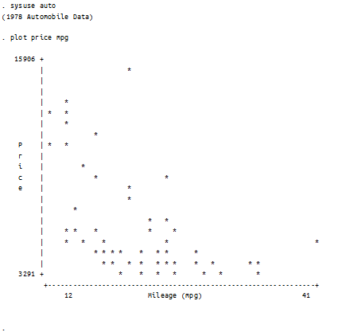
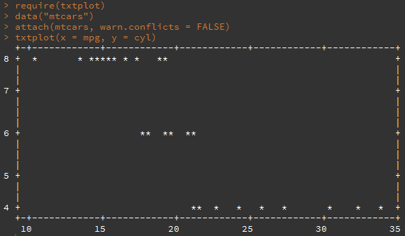

In Stata it is possible to use function plot in order to get a simple
scatter plot in Stata console. As of Stata eight, plot is no longer
supported but remains a useful tool for quickly exploring relationships
between variables. Using plot on the auto data provides the following
results:

<figure>

<figcaption aria-hidden="true">Stata Textual Plot</figcaption>
</figure>

Now the question is: can we achieve the same level of convenience in R?
Of course. The txtplot package authored by Bjoern Bornkamp provides
similar functionality. Executing the code below will generate nice text
plot straight in the R console:

<figure>

<figcaption aria-hidden="true">R Textual Plot</figcaption>
</figure>
