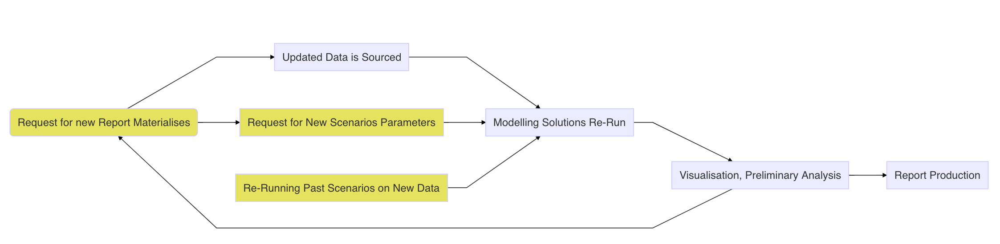

# Not so uncommon problem…

[RStudio Connect](https://rstudio.com/products/connect/) and more modest
[Shiny Proxy](https://www.shinyproxy.io) come to mind as most obvious
solutions for deploying Shiny applications in production. Application
servers are ideal for deploying applications that are to be consumed on
a regular basis by larger audiences. In addition to serving the
application, managing dependencies and user access or logging user
activity are common tasks we would expect for a publishing platform to
address. Frequently, however, deployment of Shiny application is
directed at smaller audiences and less frequent usage. In such a
situation, are availability, accessibility and user access management
requirements will be often more modest. Commonly,in business a modelling
or analytical solution can be packaged in Shiny application facilitating
periodical re-run of models with different parameters and updated data
sets. Such solutions can be conveniently utilised to facilitated
development of monthly or quarterly reports. If the app is used once per
month/quarter by a narrow user group the need to deploy it on the server
is not well articulated. In that particular case we are mostly
interested in ensuring that we can:

- Protect dependencies of our Shiny application
- Ensure that the relevant documentation is easily accessible
- Embed testing mechanism so we can be confident that we can safely
  re-run our model on a new data or with changed parameters

It is worth remaking that likely we can live without some of the things
that proper deployment solutions offer. If the app is being utilised on
an infrequent basis, very likely, we can accommodate a little bit of
occasional effort in putting the application for production. In majority
of cases, additional 5 - 15 minutes of work will seldom cause a
significant impediment in case of a analytical product that is used on
monthly or quarterly basis. Within a small user group it is also likely
that we don’t have a strong need to manage complex user access and
permissions. In effect, we are mostly interested in packaging our
modelling and reporting solution for future, infrequent, usage.

# What R community has to offer

If we remove the *Shiny application* words from the opening paragraph,
majority of criteria and our *key deliverables* correspond to what we
would usually expect to find in an R package. R packages have a robust
way of storing documentation, facilitate comprehensive unit testing and
dependency management. On the basic level the dependency management is
well addressed by the `DESCRIPTION` file that constitutes an integral
part of each R package.

> The job of the DESCRIPTION file is to store important metadata about
> your package. When you first start writing packages, you’ll mostly use
> these metadata to record what packages are needed to run your package.
> However, as time goes by and you start sharing your package with
> others, the metadata file becomes increasingly important because it
> specifies who can use it (the license) and whom to contact (you!) if
> there are any problems.

<footer>
— Hadley Wickham
</footer>

R ecosystem offers a number of sophisticated alternatives to managing
dependencies that may be more suitable for a collaborative project
progressed in an organisational and/or corporate environment[1] As we
are looking at a solution that would be usable from a perspective of an
advanced analyst it is safe to make an assumption that wise use of
`DESCRIPTION` file will suffice. Same goes for testing and documentation
development/storage. R package architecture facilitates storing and
sharing of documentations. Whereas tools, like
[`roxygen2`](https://roxygen2.r-lib.org) facilitate seamless
documentation development. R community offers a number of approaches to
unit testing with [`testthat`](https://testthat.r-lib.org) package being
one of the most popular ones.

## What about Shiny?

The tools briefly describe above will be familiar to anyone who had some
exposure to developing R packages. The key question, which still remains
unanswered, pertains to any potential way we could leverage this
architecture in order to facilitate deployment and sharing of an R
package. Fortunately, R community offers an excellent solution
facilitating distribution of Shiny applications using R package
architecture. Developed by [ThinkR](https://thinkr.fr/) R package
[`golem`](https://github.com/ThinkR-open/golem) facilitates development
of R packages that focus on embedding Shiny applications.

# Underbelly…

Authors of [`golem`](https://github.com/ThinkR-open/golem) did an
excellent job in creating robust in package documentation and providing
vignettes on development, deployment and configuration as well as a
comprehensive book[2]. In order to understand how
[`golem`](https://github.com/ThinkR-open/golem) works it’s necessary to
recognise that Shiny Application is in effect a collection of ordinary R
functions, some of which will be concerned with translating R code into
user interface. An excellent outline of the Shiny Application structure
is provided in [*Mastering Shiny*](https://mastering-shiny.org) book by
Hadley Wickham.

## Development strategy

The article makes an assumption that our Shiny Application is to serve
as a wrapper for an existing modelling or analytical solution. In that
case we would consider that we are working with a set of scripts akin to
Drake pipeline[3] In practice, this would imply that we have a set of
functions that we are ready to package into a production ready solution.
Usually we would have a set of functions that we may use to query
corporate databases via [`DBI`](https://github.com/r-dbi/DBI) or similar
solution, some pre-processing and modelling work and artefact generating
functions, such as wrapper for
[`ggplot2`](https://ggplot2.tidyverse.org) graphics and tables. Our
final product usually would be in a form of a report and/or
presentation. In practice, our quarterly report updating cycle likely
will look to the one illustrated below.

<figure>

<figcaption aria-hidden="true">Analytical BI/Modelling Flow</figcaption>
</figure>

In practical terms, yellow boxes usually imply communication with
consumers of the report and seeking clarification on usefulness of the
provided analysis. It may be that availability of new data induced us to
ask questions that weren’t previously observable. For sake of
efficiency, we would strive to automate of the remaining processes as
much as possible. If we were sufficiently foreseeing we have embedded
most of our modelling and reporting work in manageable functions.
Embedding Shiny application on that layer gives us another possibility
of further automating the process of report delivery and re-running
analysis.

[1] Useful list is mentioned in [this
discusion](https://stackoverflow.com/q/43018752/1655567) at Stack
Overflow.

[2] Fay, C, Rochette, S, Guyader, V, Girard C 2020, *Engineering
Production-Grade Shiny Apps*
[https://engineering-shiny.org/](https://engineering-shiny.org/index.html)

[3] Drake is a R package facilitating development of reproducible
research projects, more information can be found on the official [GitHub
page](https://github.com/ropensci/drake).
