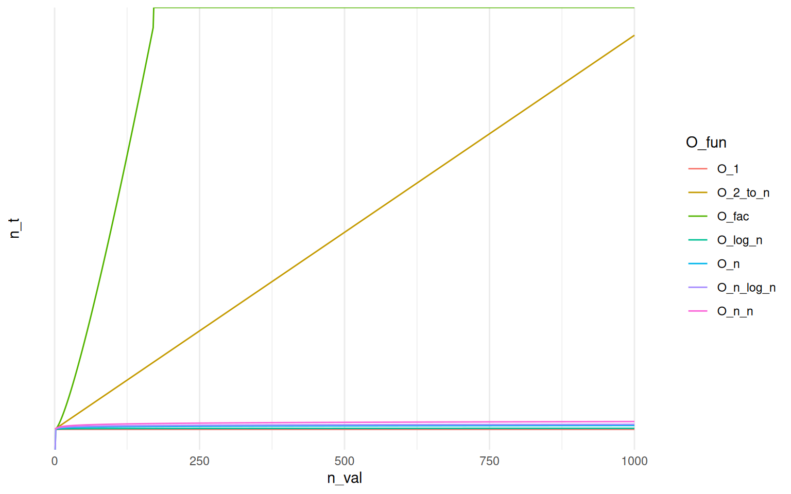

<script src="index_files/libs/kePrint-0.0.1/kePrint.js"></script>
<link href="index_files/libs/lightable-0.0.1/lightable.css" rel="stylesheet" />


# Big-O

The purpose of this is not to provide yet another primer on the Big-O/$\Omega$/$\Theta$ notation but to share my enduring appreciation for working with R. I will introduce Big-O only briefly to provide context but I would refer all of those who are interested to the linked materials.

## What is Big-sth notation...

When analysing functions, we may be interested in knowing how fast a function grows. For instance, for function $T(n)=4n^2-2n+2$, after ignoring constants, we would say that $T(n)$ grows at the order of $n^2$. With respect to the *Big-O* notation we would write $T(n)=O(n^2)$[^1]. Most commonly, in computer science, we would differentiate between Big O, Big Theta $(\Theta)$ and Big Omega $(\Omega)$. In a nutshell, the differences between those common notations can be summarised as follows:

| Notation | Growth Rate | Running Case | Comparison |
|-----------|---------------------------|-------|----------------------------|
| Big-O | Equivalent to $\le$, growth less or equal specific value | Worst case | Longest amount of time it could take to algorithm to complete |
| Big-Omega $(\Omega)$ | Equivalent to $\ge$, growth greater or equal specific value | Best case | Compared to Big-O, reflects smaller amount of time |
| Big-Theta $(\Theta)$ | Equivalent to $=$, growth equal specific value | Average case | Reflects lower and upper bound of the running time |

# The task at hand ...

So I wanted to compare a speed of some algorithms, say $n*\log(n)$, $\log(n)$, $n^2$ and so forth. I need a quick visual aid where I could plot some most common running times and quickly add more to compare how the common implementations perform against the algorithm I was working on.

## Functions

So I've defined a few functions that correspond to the frequently-used Big-O curves that can be found in majority of introductory literature on the subject with the intention of quickly producing visual base for the subject.

``` r
O_1       <- function(n) {(rep(1,length(n)))}
O_log_n   <- function(n) {log(n)}
O_n       <- function(n) {n}
O_n_log_n <- function(n) {n * log(n)}
O_n_n     <- function(n) {n^2}
O_2_to_n  <- function(n) {2^n}
O_fac     <- function(n) {factorial(n)}
```

## The "requirements"

After defining the above I wanted a quick way of plotting the data. The easiest approach would be to define the table where I could execute all of the functions. Let's say for $n = 10$ we could do the following:

``` r
n <- 10
suppressPackageStartupMessages(library("tidyverse"))
tibble(.rows = n) %>%
    mutate(O_n = map_dbl(1:n, O_1),
           O_log_n = map_dbl(1:n, O_log_n))
```

    # A tibble: 10 × 2
         O_n O_log_n
       <dbl>   <dbl>
     1     1   0    
     2     1   0.693
     3     1   1.10 
     4     1   1.39 
     5     1   1.61 
     6     1   1.79 
     7     1   1.95 
     8     1   2.08 
     9     1   2.20 
    10     1   2.30 

The problems with this approach is apparent. I didn't want to type `O_this_and_that` x number of times to name columns, call functions and then be adding removing the functions I've already tested. I needed for R to:

-   Automatically identify all of the relevant function
-   Call each function on a sequence `1:n`
-   Pack everything in a neat table so I can play with it by plotting, etc..

# Solution

The actual solution can condensed further but I have broke it down for easier readability. First I've started with identifying the functions.

``` r
Fun_names <- ls(pattern = "O_*")
Funs_O <- mget(Fun_names) # Create a list of functions
head(Funs_O, n = 2) # Preview
```

    $O_1
    function (n) 
    {
        (rep(1, length(n)))
    }
    <bytecode: 0x55555979e0d0>

    $O_2_to_n
    function (n) 
    {
        2^n
    }

Now I needed to call each of those functions and pack the results into a tibble or a data.frame. This is achieved by the code below.

``` r
map_df(Funs_O, ~ map_dbl(1:n, ~ .x(.x)))
```

    # A tibble: 10 × 7
         O_1 O_2_to_n   O_fac O_log_n   O_n O_n_log_n O_n_n
       <dbl>    <dbl>   <dbl>   <dbl> <dbl>     <dbl> <dbl>
     1     1        2       1   0         1      0        1
     2     1        4       2   0.693     2      1.39     4
     3     1        8       6   1.10      3      3.30     9
     4     1       16      24   1.39      4      5.55    16
     5     1       32     120   1.61      5      8.05    25
     6     1       64     720   1.79      6     10.8     36
     7     1      128    5040   1.95      7     13.6     49
     8     1      256   40320   2.08      8     16.6     64
     9     1      512  362880   2.20      9     19.8     81
    10     1     1024 3628800   2.30     10     23.0    100

I reckon it requires some explanation. `map_*` function are purrr's take on R's \*apply family and map function on an element passed to the function. Starting from the inside the call `map_dbl(1:n, ~.x(.))` calls function `.x` on current element of the sequence, which is passed as `.` but another `.x` could also work!! The `map_df(O_funs, ....)` call is more cheeky as the list is actual collection of functions generated via `mget`. So instead of iterating over numbers of strings or data frames we are iterating over collection of closures. In that case our `.x` becomes a closure. Full solution for $n = 1000$ is provided below.

``` r
n <- 1e3 # This is a bad habit of mine but while in R, I've a strong preference for using 1e6 for a million, 1e2 for hundred and so forth
dta_big_o <- map_df(mget(Fun_names), ~ map_dbl(1:n, ~ .x(.x)))
```

#### Preview

For $n = 1000$ we obtain:

| O_1 | O_2_to_n | O_fac | O_log_n |  O_n | O_n_log_n |   O_n_n |
|----:|---------:|------:|--------:|-----:|----------:|--------:|
|   1 |  2.0e+00 |     1 |    0.00 |    1 |       0.0 |       1 |
|   1 |  4.0e+00 |     2 |    0.69 |    2 |       1.4 |       4 |
|   1 |  8.0e+00 |     6 |    1.10 |    3 |       3.3 |       9 |
|   1 |  1.6e+01 |    24 |    1.39 |    4 |       5.5 |      16 |
|   1 |  3.2e+01 |   120 |    1.61 |    5 |       8.1 |      25 |
|   1 |  6.4e+01 |   720 |    1.79 |    6 |      10.8 |      36 |
|   1 | 3.3e+299 |   Inf |    6.90 |  995 |    6868.2 |  990025 |
|   1 | 6.7e+299 |   Inf |    6.90 |  996 |    6876.1 |  992016 |
|   1 | 1.3e+300 |   Inf |    6.90 |  997 |    6884.0 |  994009 |
|   1 | 2.7e+300 |   Inf |    6.91 |  998 |    6891.9 |  996004 |
|   1 | 5.4e+300 |   Inf |    6.91 |  999 |    6899.9 |  998001 |
|   1 | 1.1e+301 |   Inf |    6.91 | 1000 |    6907.8 | 1000000 |

## Plotting

Plotting functions actually becomes trivial with use of `dplyr` and `ggplot2`. As shown below, we can leverage the previous solution using `mget` to dynamically pull all of the refreshed functions and keep on re-generating the plot to get a view on the running time of the relevant algorithm. Here, I'm using `Fun_names` to avoid unnecessary verbosity but this could be replaced with the `ls` call.

``` r
map_df(mget(Fun_names), ~ map_dbl(1:n, ~ .x(.x))) %>%
    rownames_to_column("n_val") %>%
    mutate(n_val = as.integer(n_val)) %>%
    pivot_longer(!n_val, names_to = "O_fun", values_to = "n_t") %>%
    ggplot(aes(x = n_val, y = n_t, group = O_fun, colour = O_fun)) +
    geom_line() +
    scale_y_continuous(trans = "log10") + 
    theme_minimal()
```



# Remarks

In a production setting, we probably wouldn't rely on `ls(pattern = ...)` and `mget` sourcing objects by name. Even with providing the `mode` argument for `mget` and limiting results to function there is a risk that our code could capture an undesired call that from one or another reason could appear in the environment where `ls` would happen to be executing search. Finally for quickly plotting trivial functions, like $y=log(x)^2$ can be easily achieved with use of dedicated software. Mac users will already have [Grapher](https://support.apple.com/en-gb/guide/grapher/gcalb3dec608/mac) installed that meets that requirement. Personally, I appreciate use cases demonstrating R's flexibility as [functionals](https://adv-r.hadley.nz/functionals.html) and meta-programming are actual efficiency powerhouses.

[^1]: MIT. (2021, December 9). Big O notation. Introduction to Computers and Programming. Retrieved December 26, 2021, from <https://web.mit.edu/16.070/www/lecture/big_o.pdf>
