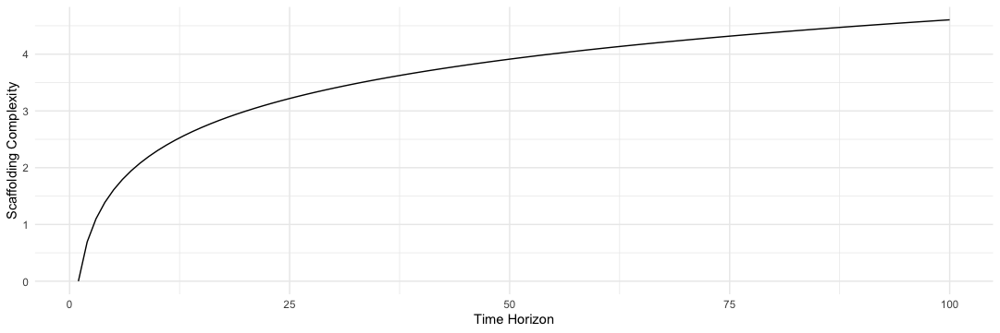

# On Structuring Python Projects
Konrad Zdeb
2022-03-16

## Types of Projects

The term *Python project* can be somewhat misleading. While languages
like Swift are designed for specific purposes such as generating
macOS/iOS apps, components, and frameworks, Python is used in a much
more versatile manner. A *Python project* might range from an analytical
solution developed across multiple Jupyter notebooks to a standalone
script querying a database API and extracting results to an application
or package facilitating the deployment of models. Each of these projects
has its own key usability requirements. For instance, if end-users will
utilize our project through a command-line interface, we will focus on
argument parsing and other elements facilitating user-friendly
execution.

### Data Science, Model, Tool, and Hybrid

In business practice, I have come across a few common types of projects.
The distinction I draw between pure *data science* and *model* projects
is somewhat arbitrary and frequently blurred but useful.

### Time Horizon

The time horizon approach to project structure is hugely beneficial as
it enables us to narrow down the gap between the complexity of the
project scaffolding and the time horizon. If visualized, it might look
something like this:




## Set-up

## File structure

While in certain scenarios we may get away with a single-file setup, any
wider collaboration is usually easier if the project structure spans
multiple files.

## Testing

When structuring Python projects, it’s essential to understand the
difference between `setup.py` and `setup.cfg`, as both are used for
packaging and distribution but serve slightly different purposes.

### `setup.py`

`setup.py` is a Python script traditionally used for configuring a
Python package. It contains a `setup()` function from the `setuptools`
module, which defines the metadata and dependencies of the project.

#### Pros:

- **Flexibility**: Being a Python script, `setup.py` allows for complex
  logic to determine the package’s configuration.
- **Wide Usage**: It has been the standard for many years, meaning it is
  widely supported and understood within the Python community.
- **Dynamic Configuration**: You can dynamically set values, run
  additional code, or perform custom setup steps.

#### Cons:

- **Readability**: Because it can contain arbitrary code, it might be
  harder to read and understand compared to a static configuration file.
- **Complexity**: For simple projects, the added flexibility might be
  overkill and lead to unnecessary complexity.

### Example of `setup.py`:

``` python
from setuptools import setup, find_packages

setup(
    name='example_package',
    version='0.1',
    packages=find_packages(),
    install_requires=[
        'numpy',
        'pandas'
    ],
)
```

### `setup.cfg`

`setup.cfg` is an INI file used to configure a Python package. It serves
the same purpose as `setup.py` but in a declarative manner. This means
you can specify the metadata and dependencies of the project in a
static, easy-to-read format.

#### Pros:

- **Readability**: The INI format is more readable and easier to
  understand, especially for those who are not familiar with Python.
- **Simplicity**: For many projects, especially simpler ones,
  `setup.cfg` provides all the needed configuration without the
  complexity of a script.
- **Separation of Concerns**: Keeps configuration separate from code,
  adhering to the principle of separating configuration from the
  implementation.

#### Cons:

- **Limited Flexibility**: Being a static file, it cannot perform
  dynamic operations or complex logic.
- **Less Dynamic**: If you need to compute values or execute code during
  setup, `setup.cfg` cannot handle these scenarios.

### Example of `setup.cfg`:

``` ini
[metadata]
name = example_package
version = 0.1

[options]
packages = find:
install_requires =
    numpy
    pandas
```

## Summary

Structuring Python projects effectively requires understanding the
different types of projects and their unique needs. Whether it’s a data
science project, a model, a tool, or a hybrid, each has its own
requirements for usability and collaboration. The choice between using
`setup.py` and `setup.cfg` for project configuration also plays a
significant role. While `setup.py` offers flexibility and dynamic
configuration through Python scripting, `setup.cfg` provides a more
readable, simpler, and declarative approach. Each option has its pros
and cons, and the right choice depends on the specific needs and
complexity of the project. By carefully considering these factors, you
can ensure your Python projects are well-organized, maintainable, and
easy to collaborate on.
