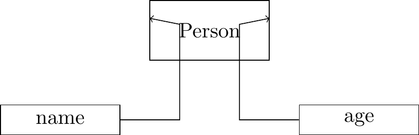
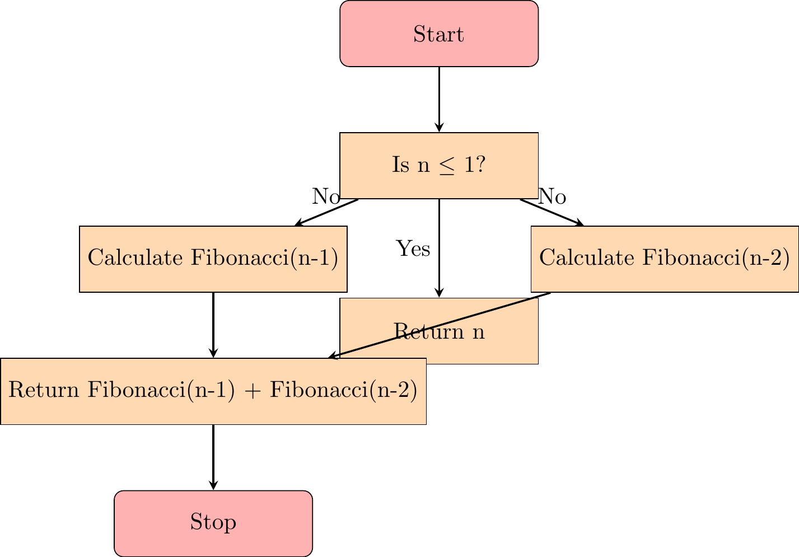
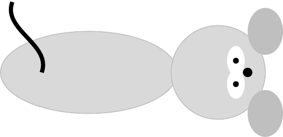

## Background

For a computer, an image is collection of interpretable instructions that amount to a visual representation. Raster images are composed from using pixels, containing unique colours, whereas vector images keep track of points and equations that join them.  In `\(\LaTeX\)` PGF/TikZ is used to generate vector graphics from algebraic descriptions. TikZ is mostly used to conveniently draw various scientific figures. ChatGPT is capable of generating computer code in majority of popular languages. I wanted to test how far I can get with ChatGPT generating illustrations using TikZ.

## ChatGPT Conversation

Let's jump right in and see how ChatGPT deals with simple request to draw a class diagram? For the request:

> Can you draw an example of a class "Person" with the properties "name" and "age" using TikZ?

The ChatGPT will return the following code. 


``` tex
\begin{tikzpicture}
  \node[draw, class] (Person) at (0,0) {Person};
  \node[draw, attribute] (name) at (-2.5,-1.5) {name};
  \node[draw, attribute] (age) at (2.5,-1.5) {age};
  
  \draw[->] (name) -- (-0.5,-1.5) -- (-0.5,0.1) -- (Person);
  \draw[->] (age) -- (0.5,-1.5) -- (0.5,0.1) -- (Person);
\end{tikzpicture}
```

There are certain mistakes in that code. The code refers to `attribute` and `class` styles that are not defined. We can amend that by giving ChatGPT are more specific set of instructions. The code compiles but looks horribly.


``` tex
\begin{tikzpicture}[
  class/.style={draw, rectangle, minimum width=2cm, minimum height=1cm},
  attribute/.style={draw, rectangle, minimum width=2cm, minimum height=0.5cm}
]
  \node[class] (Person) at (0,0) {Person};
  \node[attribute] (name) at (-2.5,-1.5) {name};
  \node[attribute] (age) at (2.5,-1.5) {age};
  
  \draw[->] (name) -- (-0.5,-1.5) -- (-0.5,0.1) -- (Person);
  \draw[->] (age) -- (0.5,-1.5) -- (0.5,0.1) -- (Person);
\end{tikzpicture}
```


<div class="figure">

<p class="caption"><span id="fig:TrivialClassAmended"></span>Figure 1: Sample Class</p>
</div>

The graphs are horrible but by providing ChatGPT with additional instructions, likely we would be able to arrive at an acceptable solution. It would possibly make sense to test how the ChatGPT would handle a more complex request. 

> Could you create a flow chart illustrating a recursive implementation for computing Fibonacci numbers?


``` tex
\usetikzlibrary{shapes.geometric, arrows}

\begin{tikzpicture}[node distance=2cm]

\tikzstyle{startstop} = [rectangle, rounded corners, minimum width=3cm, minimum height=1cm,text centered, draw=black, fill=red!30]
\tikzstyle{process} = [rectangle, minimum width=3cm, minimum height=1cm, text centered, draw=black, fill=orange!30]
\tikzstyle{arrow} = [thick,->,>=stealth]

\node (start) [startstop] {Start};
\node (decide) [process, below of=start] {Is n $\leq$ 1?};
\node (result) [process, below of=decide, yshift=-0.5cm] {Return n};
\node (calc1) [process, below left of=decide, xshift=-2cm] {Calculate Fibonacci(n-1)};
\node (calc2) [process, below right of=decide, xshift=2cm] {Calculate Fibonacci(n-2)};
\node (add) [process, below of=calc1] {Return Fibonacci(n-1) + Fibonacci(n-2)};
\node (stop) [startstop, below of=add] {Stop};

\draw [arrow] (start) -- (decide);
\draw [arrow] (decide) -- node[anchor=east] {Yes} (result);
\draw [arrow] (decide) -- node[anchor=south] {No} (calc1);
\draw [arrow] (decide) -- node[anchor=south] {No} (calc2);
\draw [arrow] (calc1) -- (add);
\draw [arrow] (calc2) -- (add);
\draw [arrow] (add) -- (stop);

\end{tikzpicture}
```


<div class="figure">

<p class="caption"><span id="fig:FlowChart"></span>Figure 2: Fibonacci Flow Chart</p>
</div>

Clearly ChatGPT version struggles to attend to all small details of the proper flow chart representation as the produced visuals makes this nodes overlap and arrows are cutting across nodes which is also rather undesirable; nevertheless, in a broad sense the produced flow chart contains elements that we would be expecting to find in a professionally produced diagram.

## Drawing Real Life Object

As demonstrated, ChatGPT can handle fairly involve instructions and deliver usable results. The produced outputs require further tweaking, which we could achieve by issuing more detailed instructions to the ChatGPT or by manually adjusting placement of node elements and arrows. The goal was to check how the ChatGPT will handle generating real-life objects using TikZ. Finally, I've asked ChatGPT to do the following:

> Can you draw a German Shepherd using TikZ?

ChatGPT correctly recognised the impossibility of this task:

> Creating a detailed drawing of a German Shepherd using TikZ would be a complex and time-consuming task, as TikZ is primarily a vector graphics tool for creating diagrams and shapes. It's not ideal for highly detailed illustrations like a realistic dog.

Still was able to produce the following results:


``` tex
\begin{tikzpicture}
  % Dog body
  \draw[gray!50, fill=gray!30] (0,0) ellipse (1.5 and 0.7);

  % Dog head
  \draw[gray!50, fill=gray!30] (2.2,0) circle (0.8);

  % Dog ears
  \fill[gray!50] (3,0.7) ellipse (0.3 and 0.4);
  \fill[gray!50] (3,-0.7) ellipse (0.3 and 0.4);

  % Dog eyes
  \fill[white] (2.5,0.2) ellipse (0.15 and 0.25);
  \fill[white] (2.5,-0.2) ellipse (0.15 and 0.25);
  \fill[black] (2.5,0.2) circle (0.05);
  \fill[black] (2.5,-0.2) circle (0.05);

  % Dog nose
  \fill[black] (2.7,0) circle (0.08);

  % Dog tail
  \draw[line width=2pt] (-0.8,0) to[out=70,in=250] (-1.3,1.2);
\end{tikzpicture}
```


<div class="figure">

<p class="caption"><span id="fig:GermanShephard"></span>Figure 3: German Shephard</p>
</div>


