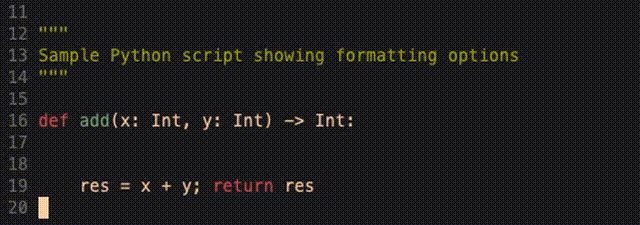

Vim provides a wide range of functions for file formatting, starting with basic features such as `reindent`.

## VimL Implementation 

Creating a function within Vim to process the file is likely the most straightforward approach. The primary purpose of this function is to pass the filename to an external command for formatting. Leveraging the rich ecosystem of Python formatting tools available from the command line allows the function to efficiently and consistently format files, tapping into powerful, pre-existing solutions for code aesthetics and standardization. In effect, the role of the function is to pass the filename to the call below:

```shell
autopep8 --verbose --in-place --aggressive --aggressive   ${our_python_file}
```

This is the simplest implementation, where the file path is passed into the formatting function, and the formatted file is then read back into the buffer.

```vim
" Aggresively and quickly format Python file
function! FormatThisPythonFile()
	 let filename = expand("%")
	 let cmd = "autopep8 --verbose --in-place --aggressive --aggressive " . filename
	 let result = system(cmd)
	 execute(':edit! ' . filename)
	 echo result
endfunction
```

1. **Define Function:** The function `FormatThisPythonFile` is defined to format the current Python file.
2. **Get Filename:** `let filename = expand("%")` retrieves the name of the current file being edited in Vim.
3. **Construct Command:** `let cmd = "autopep8 --verbose --in-place --aggressive --aggressive " . filename` constructs the command to run `autopep8` with the aggressive formatting options on the file.
4. **Execute Command:** `let result = system(cmd)` executes the constructed command using the system shell and stores the result.
5. **Reload File:** `execute(':edit! ' . filename)` reloads the formatted file into the Vim buffer to reflect the changes made by `autopep8`.
6. **Output Result:** echo result outputs the result of the `autopep8` command to the user.

This implementation has a few major drawbacks:

* To pass the most recent content of the file into `autopep8`, the file must be saved.
* More importantly, the file's history is lost at this stage.

An alternative implementation avoids these issues by not replacing the file content directly. Instead, it updates the buffer with the formatted content. This function could look as follows:

```vim
function! FormatThisPythonFile()
	let filename = expand("%")
	let cmd = "autopep8 --aggressive --aggressive " . filename
	let result = system(cmd)
	execute "%d"
	put =result
	exec "1,1d"
endfunction
command FormatThisPythonFile call FormatThisPythonFile()
```

In this implementation:

1. The filename is retrieved using `expand("%")`.
2. The `autopep8` command is constructed and executed, with its output stored in the `result` variable.
3. The current buffer content is deleted with `execute "%d"`.
4. The formatted content from `result` is inserted back into the buffer.
5. The first line, which may be an empty line due to the `put` command, is deleted with `exec "1,1d"`.
6. The command `FormatThisPythonFile` is created to call the function.

## Example

The GIF below demonstrates the changes between the formatted and unformatted versions of the file after using the function, along with the ability to switch between the historical and formatted versions of the file.



## Conclusion

Vim's extensibility makes it an excellent tool for developers who want to integrate powerful command-line utilities into their workflow. By leveraging Python formatting tools like `autopep8`, you can maintain clean and consistent code effortlessly. The ability to create custom Vim functions to automate these tasks further enhances productivity and ensures that your code adheres to best practices with minimal effort. This seamless integration of command-line tools within Vim highlights its flexibility and power, making it an invaluable asset for any developer's toolkit.

## Notable mentions

[vim-autopep8](https://github.com/tell-k/vim-autopep8), maintained by [tell-k](https://github.com/tell-k), offers an even more comprehensive implementation. It handles details such as maintaining cursor position and the ability to format selected parts of the file.
 

