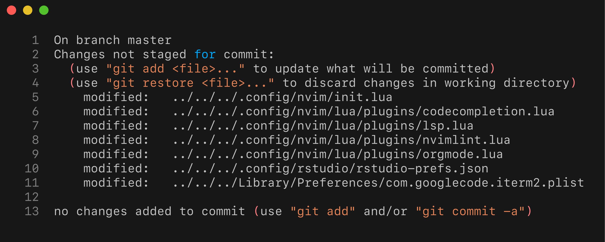

# What are .dotfiles?

Dotfiles are hidden configuration files on Unix-like systems.  
Their filenames start with a dot (`.`), making them hidden by default.  
They store preferences and settings for programs like shells, text editors, and version control systems.

Many modern Linux applications follow the XDG Base Directory Specification.  
This guideline recommends placing user-specific configuration files in `~/.config` (or `$XDG_CONFIG_HOME`).  
Using this standard reduces clutter in home directories and simplifies managing configurations across systems.

# Implementation

To version control dotfiles with Git, we create a special repository setup.  
We’ll alias this setup to a convenient `config` command, making it easy to run regular Git operations on our configurations.

For example, version controlling my Emacs configuration (`~/.emacs.d/init.el`) looks like this:
```{bash example_commiting_file, echo=TRUE, eval=FALSE}
config switch -c configs/emacs_install
config add ~/.emacs.d/init.el
config commit -as -m "Initial Emacs config"
```

## The `config` command

The config command is in effect and alias for a `git` command with defined `--work-tree` and `--git-dir` as shown. In order for this to work we need to complete a few steps:
1. Create directory where to store the dot files in my case `mkdir -v $HOME/.dotfiles`
2. As a next step we will create a bare git repository. Bare repository does not contain working tree (only contains the version contol data that is the `.git` folder)
   ```{bash bare_repo, eval=FALSE, echo=TRUE}
   git init --bare $HOME/.dotfiles/
   ```
3. Finally we want to enable `config` command; the command is simply aliased `git` command with `--work-tree` and `--git-dir` parameters and looks as follows:
   ```{bash create_config, eval=FALSE, echo=TRUE}
   alias config='/usr/bin/git --git-dir=$HOME/.doftfiles/ --work-tree=$HOME'
   ```
   What happens here:
   * The argument `--work-tree` points to where the actual files reside
   * The argument `--git-dir` specifies where we store the repository data
4. There is one more snag, in the present configuration calling the `config` command would show a vast number of untracked files. We can solve that problem by using the following git configuration
   ```{bash sample_config, eval=FALSE, echo=TRUE}
    config config --local status.showUntrackedFiles no
   ```

If this solution is working for you, you can add the line with the `alias` command to your `~/.bashrc` (or other depenidng on the shell) to make it permanently available.

# Practical example

Git-based version control for dotfiles allows easy tracking and experimentation with configurations.
Git’s branches simplify testing complex setups without risking the main configuration.

Consider my Neovim (nvim) setup.
It’s structured into multiple Lua configuration files managed by the Lazy plugin.
The current structure looks like this:

```{bash show_nvim_config, echo=TRUE}
tree ~/.config/nvim -P '*.lua' --prune
```

## Practical Example: Adding R support

Suppose I want to add R support to Neovim using the [R.nvim](https://github.com/R-nvim/R.nvim) plugin.  
This plugin enables running R code directly from Neovim, managing code completion, and improving workflows.


### Modifying multiple files 

Owing to the structure of my NVim configuration, in order to enable [R.nvim](https://github.com/R-nvim/R.nvim) support I would need to edit the following files:
* `R.nvim` - in this file I will keep the key plugin configuration
* `codecompletion.lua` - This file stores code completion configuration
* `treesitter.lua` - Treesitter, parser generator tool, is required to enable some of the key [R.nvim](https://github.com/R-nvim/R.nvim) functionalities

### Modifying multiple files

To implement [R.nvim](https://github.com/R-nvim/R.nvim), several files need updates:

* `R.nvim`: core plugin settings
* `codecompletion.lua`: code completion integration
* `treesitter.lua`: required parser configurations for R

Additionally, adjustments might be needed in `init.lua` or keymap definitions.  
If I later change my mind and prefer RStudio, reversing these changes manually could be cumbersome.

However, managing dotfiles with Git makes reverting simple.  
Before starting the new setup, I create a separate branch using my aliased Git command:

```{bash config_branch, eval=FALSE, echo=TRUE}
config switch -c configs/nvim-r-test
```

I would then work throuh the configuration changes, test NVim and play with any settings desired. Depending on what I decide to do I would commit files and merge to the master branch or abandon the work (possibly commiting changes to the branch) and switch to the master branch.

# Alternatives

Another approach uses symbolic links (`symlinks`) to a configuration-only repository.  
However, Git treats symlinks as regular text files unless `core.symlinks` is explicitly enabled, as explained in [this StackOverflow discussion](https://stackoverflow.com/q/954560/1655567).

Using hard links is similarly problematic since Git does not store inode numbers.  
Implementing hard links within Git requires third-party tools and has significant limitations, discussed in [this StackOverflow answer](https://stackoverflow.com/a/3731139/1655567).


