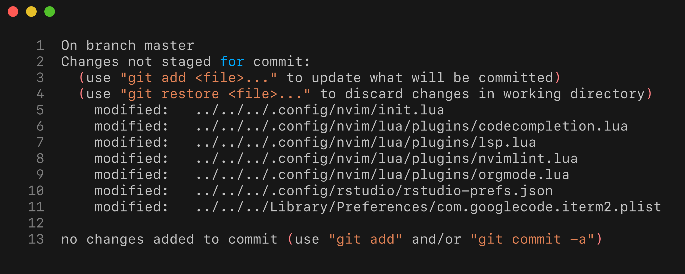

# What are .dotfiles?

Dotfiles are configuration files on Unix-like systems that begin with a dot (.) and are usually hidden by default. They store settings and preferences for various applications and system tools, such as shells, editors, and version control systems. By keeping configurations in these hidden files, users can easily customize their environments, share settings across different machines, and maintain consistency in their workflows. Some files end up in the `~/.config/` directory because many modern Linux and Unix-like programs follow the XDG Base Directory Specification, which recommends storing user-specific configuration files in the `XDG_CONFIG_HOME` directory (usually `~/.config`). This approach helps keep user home directories less cluttered by grouping all configuration files in one organized location, making it easier to manage, back up, or share custom settings across systems.

# Implementation

In order to control .dotfiles across multiple locations we need to create a special version of the git repository which I'm going to alias to a convenient `config` command. As a consequence I will be able to run traditional git commads using `config` alias to manage versioning of configuration files. Mastering Emacs is something I always wanted to do is to version control my Emacs configuration as I progress through various changes. I would initially version control main Emacs configuration file `~/.emacs.d/init.el`:

``` bash
config switch -c configs/emacs_install
config add ~/.emacs.d/init.el
config commit -as -m "Initial Emacs config"
```

## The `config` command

The config command is in effect and alias for a `git` command with defined `--work-tree` and `--git-dir` as shown. In order for this to work we need to complete a few steps:
1. First create directory where to store the dot files in my case `mkdir -v $HOME/.dotfiles`
2. As a next step we will create a bare git repository. Bare repository does not contain working tree (only contains the version contol data `.git`)
   
   ``` bash
   git init --bare $HOME/.dotfiles/
   ```
3. Finally we want to enable `config` command; the command is simply aliased `git` command with `--work-tree` and `--git-dir` parameters and looks as follows:
   
   ``` bash
   alias config='/usr/bin/git --git-dir=$HOME/.doftfiles/ --work-tree=$HOME'
   ```
   What happens here:
   * The argument `--work-tree` tells git where the project files live
   * The argument `--git-dir` specifies where we store the repository data
4. There is one more snag, in the present configuration calling the `config` command would show a vast number of untracked files. We can solve that problem by using the following git configuration
   
   ``` bash
    config config --local status.showUntrackedFiles no
   ```

If this solution is working for you, you can add the line with the `alias` command to your `~/.bashrc` (or other depenidng on the shell) to make it permanently available.

# Practical example

Successfully implementing git-based version control of dotfiles allows for tracking of all changes to the configuration files. In addition, the approach also permits for efficient testing of configuration via git's branching mechanism. The last option is particulary exciting if we want to experiment with more complex configuration settings. 
Let's consider following scenrio. I like to use nvim for majority of my coding work. NVim has exceptionally riach plugin ecosystem, well-established vim plugins can be used alongside nvim-specific extensions written mostly in Lua. I manage my NVim plugin configuration using Lazy, with multiple `*.lua` files storinh configurations for specific plugins. For instance, my nvim configuration is scattered across a number of Lua files. In effect my NVim configuration looks as follows:


``` bash
tree ~/.config/nvim -P '*.lua' --prune
```

```
## /Users/konrad/.config/nvim
## ├── init.lua
## └── lua
##     ├── config
##     │   └── lazy.lua
##     └── plugins
##         ├── R.lua
##         ├── autolist.lua
##         ├── autopairs.lua
##         ├── autosession.lua
##         ├── code-runner.lua
##         ├── codecompletion.lua
##         ├── conform.lua
##         ├── gruvbox.lua
##         ├── kanagawa.lua
##         ├── lsp.lua
##         ├── lualine.lua
##         ├── mason.lua
##         ├── neogen.lua
##         ├── neogit.lua
##         ├── neotree.lua
##         ├── nvim-ts-autotag.lua
##         ├── nvimlint.lua
##         ├── orgmode.lua
##         ├── snippets.lua
##         ├── startup.lua
##         ├── telescope-undo.lua
##         ├── telescope.lua
##         ├── templates.lua
##         ├── treesitter.lua
##         └── wilder.lua
## 
## 4 directories, 27 files
```

## Practical Example: Adding R support

I would like to enhance my NVim installation to support better working with R files. In general, I'm  looking for ability to run selected fragments and full R code managing consistency of environment and facilitate other basic functions, such as code completion. Fortunately [R.nvim](https://github.com/R-nvim/R.nvim) plugin addresses those requeiriemnts.

### Modyfying multiple files 

Owing to the structure of my NVim configuration, in order to enable [R.nvim](https://github.com/R-nvim/R.nvim) support I would need to edit the following files:
* `R.nvim` - in this file I will keep the key plugin configuration
* `codecompletion.lua` - This file stores code completion configuration
* `treesitter.lua` - Treesitter, parser generator tool, is required to enable some of the key [R.nvim](https://github.com/R-nvim/R.nvim) functionalities

Depending on the actual setup I may need/want to modify `init.lua` or other files defining keymaps and so forth. Let's further consider a scenario where after implementing the necessary changes across multiple configuration files I come to realisation that I do not want to rely on NVim when working with R code and that I prefer to continue using RStudio. No problem with that, but then in order to reverse back the configuration I would need to restore multiple files to their previous states.

Managing dotfiles configuration makes this challenge a breeze. When working on the initial configuration I would simply create a branch of my whole system conifguration using aliased git command:


``` bash
config switch -c configs/nvim-r-test
```

I would then work throuh the configuration changes, test NVim and play with any settings desired. Depending on what I decide to do I would commit files and merge to the master branch or abandon the work (possibly commiting changes to the branch) and switch to the master branch.

# Alternatives

A potential alternative could be to create a configuration only repositoiry using symlinks. This can be problematic as if the `core.symlinks` variable is not set to `true` git will treat symbolink links as small plain text files. This is covered in detail in this [StackOverflow discussion](https://stackoverflow.com/q/954560/1655567). Simrarly, trying to use hardlinks with git comes with another set of challenges. Git doesn't store inode number and makes it impossible to utilised hard links in repository without relying on thrid party tools, as discussed at lengths in [this StackOverflow answer](https://stackoverflow.com/a/3731139/1655567).

