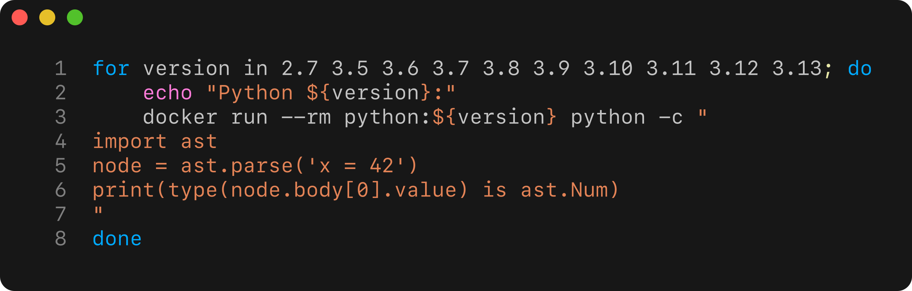

<figure>

<figcaption aria-hidden="true">Executing Python command across multiple
versions</figcaption>
</figure>

Setting up a robust data science development environment takes time, and
it’s a process that’s rarely ever finished. If you’re the type who likes
to get the most out of your tools, you’ll likely enjoy tweaking,
optimising, and layering your workspace with productivity enhancements.
That might mean refining your Python setup to easily manage multiple
language versions and dependencies, or expanding your text editor with
plugins for linting, code suggestions, unit test execution, and CI/CD
integration.

The only constant is that your environment is always evolving. I
recently moved from `vim` to `nvim` and rewrote much of my VimL-based
configuration in Lua—something I’d never touched before. If you’re
experimenting, learning, and building in parallel, having a clean way to
isolate and test changes becomes invaluable.

## Managing tools without installing them

In most cases, I use Homebrew to manage system components on my machine,
and it works well. But there are situations where installing something
locally feels excessive—especially if I only need it temporarily.

## Solution

Examples provided below work on the same basis, the code and commands
are executed within disposable Docker containers. The process of needing
to install software on local machine is completely removed from the
system

## Example: Python AST across versions

Suppose you’re working with a simple Python script using the `ast`
module, which allows you to parse and analyse Python code as an abstract
syntax tree. This is commonly used in tools like linters or code
formatters, but also in more advanced metaprogramming scenarios.

Here’s a minimal script that parses the assignment `x = 42` and checks
whether the literal `42` is represented using `ast.Num`.

Intuitively, we might expect this to return `True`—after all, `42` is a
number, and `ast.Num` seems appropriate. But that’s not always the case.

Now we run it across various Python versions using Docker.

    import ast
    print(type(ast.parse("x = 42").body[0].value) is ast.Num)

I will store this script as `/tmp/check_ast.py`. Using the docker one
liner, I will execute the script in multiple version of Python.

    for version in 2.7 3.5 3.6 3.7 3.8 3.9 3.10 3.11 3.12 3.13; do
        echo "Python ${version}:"
        docker run --rm -v /tmp/check_ast.py:/check_ast.py python:$version python /check_ast.py
    done

    ## Python 2.7:
    ## Unable to find image 'python:2.7' locally
    ## 2.7: Pulling from library/python
    ## d080dad46627: Pulling fs layer
    ## 0d8c76f34793: Pulling fs layer
    ## 454b6b37aa5f: Pulling fs layer
    ## 0caa3b229430: Pulling fs layer
    ## 3b47ba45af89: Pulling fs layer
    ## 7265f9167afe: Pulling fs layer
    ## 2bfc998b0cd0: Pulling fs layer
    ## 089c17f1d7bf: Pulling fs layer
    ## 1ce677d6f052: Pulling fs layer
    ## 7265f9167afe: Waiting
    ## 2bfc998b0cd0: Waiting
    ## 089c17f1d7bf: Waiting
    ## 1ce677d6f052: Waiting
    ## 0caa3b229430: Waiting
    ## 3b47ba45af89: Waiting
    ## 0d8c76f34793: Verifying Checksum
    ## 0d8c76f34793: Download complete
    ## d080dad46627: Verifying Checksum
    ## d080dad46627: Download complete
    ## d080dad46627: Pull complete
    ## 0d8c76f34793: Pull complete
    ## 0caa3b229430: Verifying Checksum
    ## 0caa3b229430: Download complete
    ## 7265f9167afe: Verifying Checksum
    ## 7265f9167afe: Download complete
    ## 3b47ba45af89: Download complete
    ## 089c17f1d7bf: Verifying Checksum
    ## 089c17f1d7bf: Download complete
    ## 2bfc998b0cd0: Verifying Checksum
    ## 2bfc998b0cd0: Download complete
    ## 1ce677d6f052: Verifying Checksum
    ## 1ce677d6f052: Download complete
    ## 454b6b37aa5f: Verifying Checksum
    ## 454b6b37aa5f: Download complete
    ## 454b6b37aa5f: Pull complete
    ## 0caa3b229430: Pull complete
    ## 3b47ba45af89: Pull complete
    ## 7265f9167afe: Pull complete
    ## 2bfc998b0cd0: Pull complete
    ## 089c17f1d7bf: Pull complete
    ## 1ce677d6f052: Pull complete
    ## Digest: sha256:cfa62318c459b1fde9e0841c619906d15ada5910d625176e24bf692cf8a2601d
    ## Status: Downloaded newer image for python:2.7
    ## True
    ## Python 3.5:
    ## True
    ## Python 3.6:
    ## True
    ## Python 3.7:
    ## Unable to find image 'python:3.7' locally
    ## 3.7: Pulling from library/python
    ## 796cc43785ac: Pulling fs layer
    ## 91290b4a0590: Pulling fs layer
    ## 7d8d278f2f73: Pulling fs layer
    ## c1d99d3ae80a: Pulling fs layer
    ## bf433ef057e1: Pulling fs layer
    ## 755c46732d51: Pulling fs layer
    ## 669bb33af58b: Pulling fs layer
    ## 25ed8b4726d4: Pulling fs layer
    ## 25ed8b4726d4: Waiting
    ## 669bb33af58b: Waiting
    ## bf433ef057e1: Waiting
    ## 755c46732d51: Waiting
    ## c1d99d3ae80a: Waiting
    ## 91290b4a0590: Verifying Checksum
    ## 91290b4a0590: Download complete
    ## 7d8d278f2f73: Verifying Checksum
    ## 7d8d278f2f73: Download complete
    ## 796cc43785ac: Verifying Checksum
    ## 796cc43785ac: Download complete
    ## 796cc43785ac: Pull complete
    ## 91290b4a0590: Pull complete
    ## 755c46732d51: Verifying Checksum
    ## 755c46732d51: Download complete
    ## 669bb33af58b: Verifying Checksum
    ## 669bb33af58b: Download complete
    ## bf433ef057e1: Verifying Checksum
    ## bf433ef057e1: Download complete
    ## 7d8d278f2f73: Pull complete
    ## 25ed8b4726d4: Verifying Checksum
    ## 25ed8b4726d4: Download complete
    ## c1d99d3ae80a: Verifying Checksum
    ## c1d99d3ae80a: Download complete
    ## c1d99d3ae80a: Pull complete
    ## bf433ef057e1: Pull complete
    ## 755c46732d51: Pull complete
    ## 669bb33af58b: Pull complete
    ## 25ed8b4726d4: Pull complete
    ## Digest: sha256:eedf63967cdb57d8214db38ce21f105003ed4e4d0358f02bedc057341bcf92a0
    ## Status: Downloaded newer image for python:3.7
    ## True
    ## Python 3.8:
    ## Unable to find image 'python:3.8' locally
    ## 3.8: Pulling from library/python
    ## 6d11c181ebb3: Pulling fs layer
    ## 2b238499ec52: Pulling fs layer
    ## 41b754d079e8: Pulling fs layer
    ## d71ace0e8bbd: Pulling fs layer
    ## 66d992156d02: Pulling fs layer
    ## b5ab5cf667cd: Pulling fs layer
    ## 7564b5399799: Pulling fs layer
    ## d71ace0e8bbd: Waiting
    ## 66d992156d02: Waiting
    ## b5ab5cf667cd: Waiting
    ## 7564b5399799: Waiting
    ## 2b238499ec52: Verifying Checksum
    ## 2b238499ec52: Download complete
    ## 6d11c181ebb3: Verifying Checksum
    ## 6d11c181ebb3: Download complete
    ## 6d11c181ebb3: Pull complete
    ## 66d992156d02: Verifying Checksum
    ## 66d992156d02: Download complete
    ## 2b238499ec52: Pull complete
    ## 41b754d079e8: Verifying Checksum
    ## 41b754d079e8: Download complete
    ## 7564b5399799: Verifying Checksum
    ## 7564b5399799: Download complete
    ## b5ab5cf667cd: Verifying Checksum
    ## b5ab5cf667cd: Download complete
    ## 41b754d079e8: Pull complete
    ## d71ace0e8bbd: Verifying Checksum
    ## d71ace0e8bbd: Download complete
    ## d71ace0e8bbd: Pull complete
    ## 66d992156d02: Pull complete
    ## b5ab5cf667cd: Pull complete
    ## 7564b5399799: Pull complete
    ## Digest: sha256:d411270700143fa2683cc8264d9fa5d3279fd3b6afff62ae81ea2f9d070e390c
    ## Status: Downloaded newer image for python:3.8
    ## False
    ## Python 3.9:
    ## Unable to find image 'python:3.9' locally
    ## 3.9: Pulling from library/python
    ## 6fbab1970a5a: Pulling fs layer
    ## e4b341315eac: Pulling fs layer
    ## 1de51daaef20: Pulling fs layer
    ## 2c8f8efa4105: Pulling fs layer
    ## 24dadcd6c1b9: Pulling fs layer
    ## 8a46fe600284: Pulling fs layer
    ## 5bc36de056f2: Pulling fs layer
    ## 24dadcd6c1b9: Waiting
    ## 8a46fe600284: Waiting
    ## 5bc36de056f2: Waiting
    ## 2c8f8efa4105: Waiting
    ## e4b341315eac: Verifying Checksum
    ## 6fbab1970a5a: Verifying Checksum
    ## 6fbab1970a5a: Download complete
    ## 6fbab1970a5a: Pull complete
    ## e4b341315eac: Pull complete
    ## 1de51daaef20: Verifying Checksum
    ## 1de51daaef20: Download complete
    ## 24dadcd6c1b9: Verifying Checksum
    ## 24dadcd6c1b9: Download complete
    ## 5bc36de056f2: Verifying Checksum
    ## 5bc36de056f2: Download complete
    ## 1de51daaef20: Pull complete
    ## 2c8f8efa4105: Verifying Checksum
    ## 2c8f8efa4105: Download complete
    ## 2c8f8efa4105: Pull complete
    ## 24dadcd6c1b9: Pull complete
    ## 8a46fe600284: Verifying Checksum
    ## 8a46fe600284: Download complete
    ## 8a46fe600284: Pull complete
    ## 5bc36de056f2: Pull complete
    ## Digest: sha256:754dbbaf5fe730bb2460efb3300293c62c222f74fbf8534ed23691c617c9609b
    ## Status: Downloaded newer image for python:3.9
    ## False
    ## Python 3.10:
    ## Unable to find image 'python:3.10' locally
    ## 3.10: Pulling from library/python
    ## 6fbab1970a5a: Already exists
    ## e4b341315eac: Already exists
    ## 1de51daaef20: Already exists
    ## 2c8f8efa4105: Already exists
    ## 24dadcd6c1b9: Already exists
    ## 27adaab3b8de: Pulling fs layer
    ## c599c5df884f: Pulling fs layer
    ## c599c5df884f: Verifying Checksum
    ## c599c5df884f: Download complete
    ## 27adaab3b8de: Download complete
    ## 27adaab3b8de: Pull complete
    ## c599c5df884f: Pull complete
    ## Digest: sha256:6ff000548a4fa34c1be02624836e75e212d4ead8227b4d4381c3ae998933a922
    ## Status: Downloaded newer image for python:3.10
    ## False
    ## Python 3.11:
    ## Unable to find image 'python:3.11' locally
    ## 3.11: Pulling from library/python
    ## 6fbab1970a5a: Already exists
    ## e4b341315eac: Already exists
    ## 1de51daaef20: Already exists
    ## 2c8f8efa4105: Already exists
    ## 24dadcd6c1b9: Already exists
    ## 5fcf2552ed86: Pulling fs layer
    ## b265bea5c8ac: Pulling fs layer
    ## b265bea5c8ac: Download complete
    ## 5fcf2552ed86: Verifying Checksum
    ## 5fcf2552ed86: Download complete
    ## 5fcf2552ed86: Pull complete
    ## b265bea5c8ac: Pull complete
    ## Digest: sha256:c1239cb82bf08176c4c90421ab425a1696257b098d9ce21e68de9319c255a47d
    ## Status: Downloaded newer image for python:3.11
    ## False
    ## Python 3.12:
    ## Unable to find image 'python:3.12' locally
    ## 3.12: Pulling from library/python
    ## 6fbab1970a5a: Already exists
    ## e4b341315eac: Already exists
    ## 1de51daaef20: Already exists
    ## 2c8f8efa4105: Already exists
    ## 24dadcd6c1b9: Already exists
    ## 72016b6f4a3f: Pulling fs layer
    ## 3ec3ac219ace: Pulling fs layer
    ## 3ec3ac219ace: Verifying Checksum
    ## 3ec3ac219ace: Download complete
    ## 72016b6f4a3f: Verifying Checksum
    ## 72016b6f4a3f: Download complete
    ## 72016b6f4a3f: Pull complete
    ## 3ec3ac219ace: Pull complete
    ## Digest: sha256:645df645815f1403566b103b2a2bb07f6a01516bbb15078ed004e41d198ba194
    ## Status: Downloaded newer image for python:3.12
    ## False
    ## /check_ast.py:2: DeprecationWarning: ast.Num is deprecated and will be removed in Python 3.14; use ast.Constant instead
    ##   print(type(ast.parse("x = 42").body[0].value) is ast.Num)
    ## Python 3.13:
    ## Unable to find image 'python:3.13' locally
    ## 3.13: Pulling from library/python
    ## 6fbab1970a5a: Already exists
    ## e4b341315eac: Already exists
    ## 1de51daaef20: Already exists
    ## 2c8f8efa4105: Already exists
    ## 5bb9f41824e2: Pulling fs layer
    ## 2b229e0ef2e6: Pulling fs layer
    ## 6d7b469643e9: Pulling fs layer
    ## 6d7b469643e9: Verifying Checksum
    ## 6d7b469643e9: Download complete
    ## 5bb9f41824e2: Verifying Checksum
    ## 5bb9f41824e2: Download complete
    ## 5bb9f41824e2: Pull complete
    ## 2b229e0ef2e6: Verifying Checksum
    ## 2b229e0ef2e6: Download complete
    ## 2b229e0ef2e6: Pull complete
    ## 6d7b469643e9: Pull complete
    ## Digest: sha256:4ea77121eab13d9e71f2783d7505f5655b25bb7b2c263e8020aae3b555dbc0b2
    ## Status: Downloaded newer image for python:3.13
    ## /check_ast.py:2: DeprecationWarning: ast.Num is deprecated and will be removed in Python 3.14; use ast.Constant instead
    ##   print(type(ast.parse("x = 42").body[0].value) is ast.Num)
    ## False

You’ll notice the results vary. Some versions return `True`, others
return `False`. This reflects the evolution of the `ast` module.
Although `ast.Constant` was introduced in Python 3.8 to unify literals
like numbers, strings, and constants under one node type, `ast.Num`,
`ast.Str`, and related nodes were not immediately retired. In fact,
`ast.parse()` continued to return `ast.Num` in Python 3.8, 3.9, and even
3.10.0, to preserve compatibility.

As a result, `isinstance(..., ast.Num)` still returned `True` in those
versions. The complete shift to `ast.Constant` occurred in Python 3.11,
where `ast.parse()` finally stopped emitting the older nodes. This is a
good example of how language-level changes may be rolled out gradually,
and why it’s useful to test behaviour directly—rather than rely on
changelog summaries alone.

## Other interesting uses

For quick evaluation it is possible to direcltly jump into ipython
console. I find this partilculary useful if I want to check running some
code interactively in a specific version of Python.

    docker run -it --rm python:3.8 bash -c "pip install ipython && ipython"

The other trick that I find useful in those scenarios is to install
packages while in Python interactive session by calling `subprocess`,
this can be easily achieved via running `subprocess` command pointing to
`pip` as shown below:

    import subprocess
    import sys
    subprocess.run([sys.executable, "-m", "pip", "install", "pandas"], check=True)
    import pandas as pd
    print(pd.__version__)

# Summary

One-line Docker commands are a lightweight, repeatable, and isolated way
to test and explore code across environments—without cluttering your
system. They’re particularly useful when comparing behaviour across
language versions or running quick experiments in tools you don’t use
daily.
