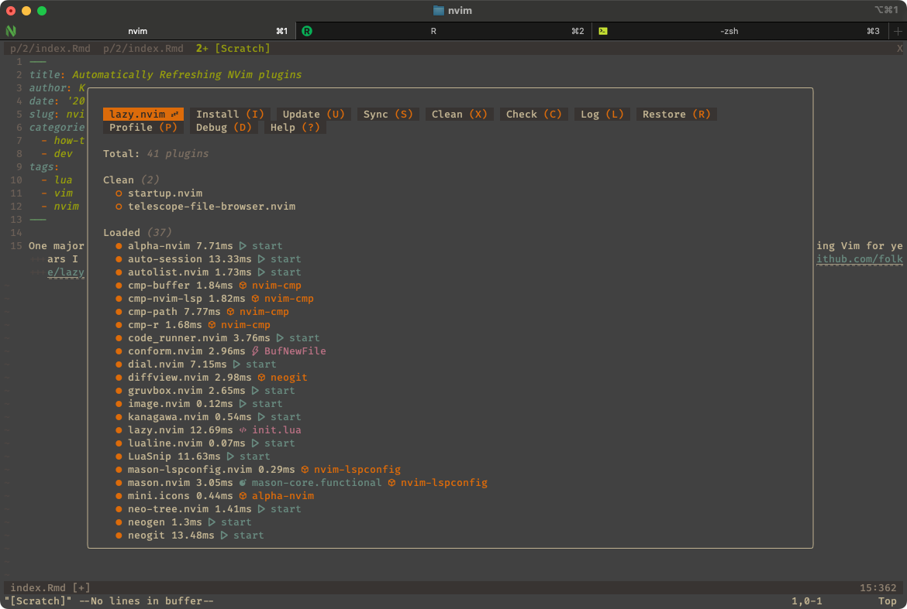

One of the key benefits of modern editors like NVim, Vim, or Emacs is
the rich plugin ecosystem. After years with Vim, I switched to NVim and
was immediately impressed by its plugin landscape. The
[Lazy](https://github.com/folke/lazy.nvim) plugin manager—available for
NVim > 0.8—quickly became my favourite.
[Lazy](https://github.com/folke/lazy.nvim) simplifies plugin discovery
and management. It offers an intuitive interface and powerful commands
that make it easy to add, remove, or update plugins.

<figure>

<figcaption aria-hidden="true">Lazy Plugin in Actions</figcaption>
</figure>

## Auto-Updating Plugins

As I added more plugins, Lazy frequently prompted me to update them. I
found myself running updates manually almost every session. Naturally, I
wanted to automate this.

Lazy supports [execution of custom
commands](https://www.lazyvim.org/configuration/general). Its
configuration allows binding actions to various events. One useful event
is VeryLazy, but more generally, NVim’s autocommand system provides a
robust mechanism for triggering code on specific actions. Inspired by a
[gist by
dtr2300](https://gist.github.com/dtr2300/2f867c2b6c051e946ef23f92bd9d1180),
I chose to trigger plugin updates on the [`FocusLost`
event](https://neovim.io/doc/user/autocmd.html). This means NVim will
automatically check for updates whenever I switch to another window—an
ideal, non-disruptive moment.

Here’s the Lua code I use:

    -- File: $XDG_CONFIG_HOME/nvim/lua/config/autocmds.lua

    local function augroup(name)
      return vim.api.nvim_create_augroup("lazyvim_" .. name, { clear = true })
    end

    vim.api.nvim_create_autocmd("FocusLost", {
      group = augroup("autoupdate"),
      callback = function()
        if require("lazy.status").has_updates() then
          vim.notify("🔄 Updating plugins...", vim.log.levels.INFO)
          require("lazy").update({
            show = false,
            -- This callback runs after update is done
            concurrency = nil,
            lockfile = nil,
            wait = true,
            plugins = nil,
            pin = nil,
            exclude = nil,
            callback = function(updated)
              if updated and #updated > 0 then
                vim.notify("✅ Lazy updated " .. #updated .. " plugin(s).", 
                    vim.log.levels.INFO)
              else
                vim.notify("✅ Lazy check complete. No plugins updated.", 
                    vim.log.levels.INFO)
              end
            end,
          })
        end
      end,
    })

Note that some plugins may require a manual reload after updating.
Lazy.nvim now supports an experimental `:Lazy reload plugin_name`
command, but this is not automatically triggered after updates.
Reloading works best with plugins that implement a proper deactivate
function or are explicitly marked as safe to reload. For others,
re-running config functions can cause issues, so use this feature
cautiously and check each plugin’s documentation or behavior before
relying on it.

The configuration lives in
`$XDG_CONFIG_HOME/nvim/lua/config/autocmds.lua` [1]. Depe

[1] If unset the `$XDG_CONFIG_HOME` points to `$HOME/.config`.
