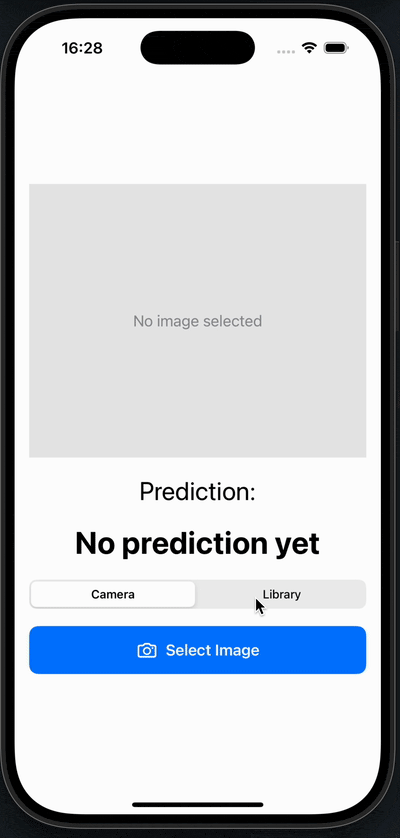

```{r setup, include=FALSE}
knitr::opts_chunk$set(
  echo = TRUE,
  message = FALSE,
  warning = FALSE
)
```

```{r, out.width="40%", echo=FALSE}

```


Integrating Python-based machine learning models into iOS applications can be challenging, particularly when converting models into a Swift-compatible format. This example will demonstrate a simple image classification task using the Fashion-MNIST dataset and CoreML conversion tools. The goal is to illustrate the effort required to deploy small-to-medium complexity ML models within iOS applications. The demonstration is based on a Convolutional Neural Network (CNN) built with PyTorch, but the concepts apply broadly to other Python-based models as well.

# Model Development

For demonstration purposes, we'll create a basic machine learning model in Python. To classify images, I'll build a simple Convolutional Neural Network (CNN) using PyTorch. The model will be trained on the Fashion-MNIST dataset, comprising 70,000 grayscale images of fashion items in 10 categories. We'll begin by sourcing a standard set of Python packages required for model development.

```{r show_python_model_trainig, echo=FALSE, results='asis'}
base_dir <- "../../../../../Swift-Xcode/SwiftPythonML/PythonMLModel"
code <- readLines(file.path(base_dir, "model_prep.py"))
cat("```python\n", paste(trimws(code[1:13]), collapse = "\n"), "\n```")
```

The model represents a fairly unsophisticated approach to handle imaghe classification task. Naturally, in a producting setting you will want to utilise more sophisticated solution, handling complex data and scenarios where you could be dealing with distorted images data (low lighting, different angles, etc.). The provided CNN implementation is fairly basic but sufficient for the purpose of this demonstration. It consists of a few convolutional layers, followed by fully connected layers, and uses ReLU activation functions. The model is trained using the Adam optimizer and cross-entropy loss function.

```{r show_python_model_dev, echo=FALSE, results='asis'}
cat("```python\n", paste(code[17:79], collapse = "\n"), "\n```")
```

## Additional Testing
In addition to evaluating model performance, we'll also test its ability to handle images provided as flat files. The tests will run against several publicly available images.

```{r show_python_model_testing, echo=FALSE, results='asis'}
code_test <- readLines(file.path(base_dir, "tests/test_model.py"))
cat("```python\n", paste(code_test, collapse = "\n"), "\n```")
```

## Converting to Core ML

A key challenge is converting and integrating the model into the Swift-based iOS application. We'll export the model into the `.mlpackage` format using available conversion tools. It's critical to ensure our model can correctly handle the required input format—in this case, images—by defining the `input_features` and `output_features`.

Proper definition of these objects is crucial when converting models (including scikit-learn) to Core ML format using `coremltools`. In this example, the input features are defined as `input_features = [("image", ct.models.datatypes.Array(1, 28, 28))]`. This configuration means the Core ML model expects a single-channel (grayscale) image of size 28x28 as input, matching the Fashion-MNIST images. This alignment ensures correct image processing within your iOS application.

Why is this important? If input features do not match the expected model shape, conversion will fail, or the resulting Core ML model may not function correctly in your app.

```{r show_python_model_convert, echo=FALSE, results='asis'}
cat("```python\n", paste(code[83:length(code)], collapse = "\n"), "\n```")
```

# Use in Swift

First, we need to import the model into our Xcode project by dragging and dropping the `.mlpackage` file into the Xcode project navigator. After importing, the model becomes available as a Swift class sharing its `.mlpackage` file name—`FashionMNISTClassifier` in this example. Inference is performed using the straightforward `predict` method, with most heavy lifting managed by the `FashionMNISTClassifierInput` class.

```{r show_swift_model_import, echo=FALSE, results='asis'}
xcode_base_dir <- "../../../../../Swift-Xcode/SwiftPythonML/MyMLApp"
code_swift <- readLines(file.path(xcode_base_dir, "MyMLApp/ModelViewModel.swift")) # nolint: line_length_linter.
cat("```swift\n", paste(code_swift[5:length(code_swift)], collapse = "\n"), "\n```") # nolint: line_length_linter.
```

## Image Preoprocessing
The Swift `ImagePreprocessor` struct provides a static method to convert a `UIImage` into a 28×28 grayscale-formatted `CVPixelBuffer`. The method resizes the image, converts it to grayscale, and produces a pixel buffer ready for inference with Core ML.

```{r show_swift_preprocess, echo=FALSE, results='asis'}
xcode_base_dir <- "../../../../../Swift-Xcode/SwiftPythonML/MyMLApp"
code_swift <- readLines(file.path(xcode_base_dir, "MyMLApp/ImagePreprocessor.swift")) # nolint: line_length_linter.
cat("```swift\n", paste(code_swift[5:length(code_swift)], collapse = "\n"), "\n```") # nolint: line_length_linter.
```

# Final Considerations
I've used a recent version of PyTorch to leverage Metal Performance Shaders (MPS)—Apple’s framework enabling GPU acceleration on Apple Silicon and Intel Macs. Although my chosen PyTorch version wasn't officially tested with Core ML Tools, it functioned without issue. However, for robustness, ensure compatibility between PyTorch and Core ML library versions.

If your use case involves image classification, consider exploring Apple’s Vision Foundation Models. These models are optimized for on-device performance and simplify common image classification tasks significantly.

Alternatively, if sticking with PyTorch is important, consider using **PyTorch Mobile**. PyTorch Mobile lets you run PyTorch models natively on-device, offering enhanced control with minimal translation between training and inference environments.

Full code, models, and app implementation are available in the repository: [SwiftPythonML](https://github.com/konradzdeb/SwiftPythonML).