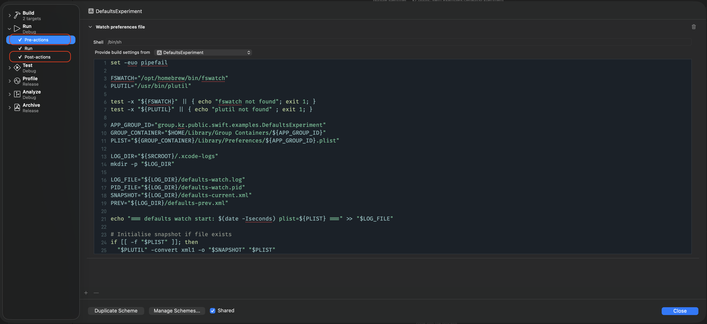
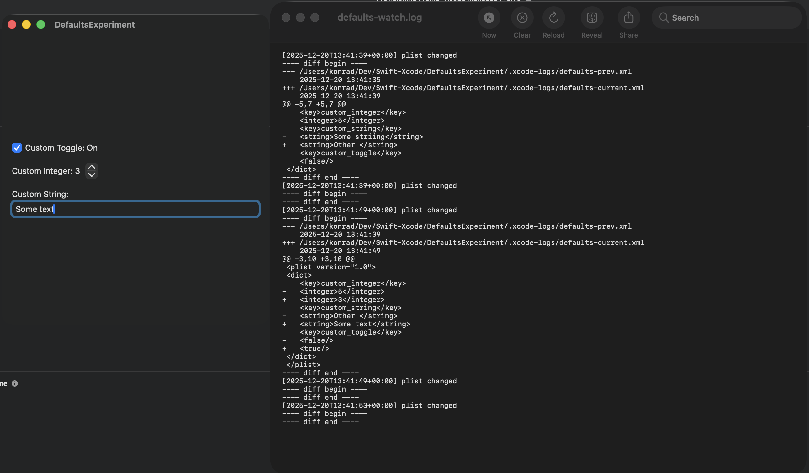

This article shows how to use Xcode scheme pre-/post-actions (Build and Run) to observe how your app creates and mutates defaults, by logging changes outside the app process.

## What are Defaults?

In Swift and macOS development, defaults (via `UserDefaults` and the `defaults` CLI) are the lightweight persistence layer for user preferences, feature toggles, and other small pieces of state that need to survive app relaunches. They sit between in-memory settings and heavier storage options, letting you read and write simple values keyed by domain so the same code works in app code, Xcode schemes, and shell scripts. Because defaults are global to a domain, careful naming and clean-up are essential to avoid collisions and stale settings during development.

For a deeper dive, Fatbobman’s [“UserDefaults and Observation in SwiftUI”](https://fatbobman.com/en/posts/userdefaults-and-observation/) is a solid blueprint: Xu Yang shows why Observation alone misses external changes, then patches the gap with a `@ObservableDefaults` macro that keeps SwiftUI views in sync with UserDefaults regardless of where writes originate. It’s an excellent, disciplined approach that centralizes keys, responds to external mutations, and favors lightweight persistence over ephemeral state. I use this approach for the rest of the article.

## Challenge

When building a macOS application that stores defaults, I wanted to see what the app writes to the defaults store—specifically, what actually ends up on disk.

## Solution

My preferred solution is to create a dedicated Xcode scheme that I use to track the defaults lifecycle for a single run. I created a basic macOS application and a set of defaults following guidance in [“UserDefaults and Observation in SwiftUI”](https://fatbobman.com/en/posts/userdefaults-and-observation/). First, I define a set of defaults that hold a few inputs from the application via an `ObservableObject`.

### The App Structure

```swift
import SwiftUI
import Combine

class Defaults: ObservableObject {
    @AppStorage("custom_toggle", store: .group) var customToggle: Bool = false
    @AppStorage("custom_integer", store: .group) var customInteger: Int = 1
    @AppStorage("custom_string", store: .group) var customString: String = "abc"
}
```

Adding a `.group` store is good practice: it enables convenient sharing of default values across targets (and extensions). I define my shared `UserDefaults` suite like this:

```swift
import Foundation

extension UserDefaults {
    static let group: UserDefaults = {
        let staticString: String = "group.xz.public.swift.examples.DefaultsExperiment"
        if let teamIdentifierPrefix = Bundle.main.object(forInfoDictionaryKey: "Team Identifier Prefix") as? String {
            return UserDefaults(
                suiteName: teamIdentifierPrefix + staticString
            ) ?? UserDefaults.standard
        } else {
            return UserDefaults(suiteName: staticString) ?? UserDefaults.standard
        }
    }()
}
```

With those basics in place, I add a simple SwiftUI view so I can modify the stored preferences.

```swift
import SwiftUI

struct ContentView: View {

    @StateObject var defaults = Defaults()

    var body: some View {
        VStack(alignment: .leading, spacing: 16) {
            Toggle("Custom Toggle: \(defaults.customToggle ? "On" : "Off")", isOn: defaults.$customToggle)
            Stepper("Custom Integer: \(defaults.customInteger)", value: defaults.$customInteger)
            VStack(alignment: .leading, spacing: 4) {
                Text("Custom String:")
                TextField("abc", text: defaults.$customString)
            }
        }
        .padding()
    }
}

```

### Observing the Observable Defaults

Now the key element: how do we conveniently observe changes to defaults? In Xcode you can use standard approaches like logging (via `os.Logger` / `OSLog`) or breakpoints. However, Apple’s implementation deliberately decouples _mutation_ from _persistence_. In practice, writes go through an in-memory cache and persistence to disk is deferred and opportunistic. A write to disk usually happens under one of the following conditions:

- Run loop idle: the process is idle and the cache flushes
- Graceful app termination (`Cmd + Q`)
- Normal quit: pending preferences are written to disk
- App lifecycle transitions (background/foreground)
- Memory pressure: forcing cache flush to reclaim memory
- Periodic internal timers (undocumented heuristics)

Given that, I wanted to observe changes to the actual file independently, without relying on logging or breakpoints. A convenient solution is to use Xcode’s pre-run and post-run actions. These can be configured in your Xcode scheme via `Product` > `Scheme` > `Edit Scheme`. To achieve the desired outcome, configure one pre-run and one post-run action.



### Pre-run Action

Most of the work for the observation pipeline happens in the pre-run action. First, create a few variables and ensure the two tools you need are available:

```bash
set -euo pipefail

FSWATCH="/opt/homebrew/bin/fswatch"
PLUTIL="/usr/bin/plutil"

test -x "${FSWATCH}" || { echo "fswatch not found"; exit 1; }
test -x "${PLUTIL}" || { echo "plutil not found" ; exit 1; }

```

Note: Xcode can continue the build even if a pre-action fails. If you need failures to be hard-stops, move the checks into a build phase. Next, define a few paths so the action is easy to compose. In practice, we want the preference plist path plus some log/snapshot locations:

```bash
APP_GROUP_ID="group.kz.public.swift.examples.DefaultsExperiment"
GROUP_CONTAINER="$HOME/Library/Group Containers/${APP_GROUP_ID}"
PLIST="${GROUP_CONTAINER}/Library/Preferences/${APP_GROUP_ID}.plist"
LOG_DIR="${SRCROOT}/.xcode-logs"
mkdir -p "$LOG_DIR"
LOG_FILE="${LOG_DIR}/defaults-watch.log"
PID_FILE="${LOG_DIR}/defaults-watch.pid"
SNAPSHOT="${LOG_DIR}/defaults-current.xml"
PREV="${LOG_DIR}/defaults-prev.xml"
```

These variables have the following responsibilities:

1. `APP_GROUP_ID`, `GROUP_CONTAINER`, and `PLIST` build the path to the binary plist.
2. `LOG_DIR` and `LOG_FILE` keep a timestamped record of diffs between plist revisions.
3. `PID_FILE` stores the background watcher PID so the post-run action can stop it.
4. `SNAPSHOT` and `PREV` store XML snapshots of the current and previous plist for diffing.

The final part of the script spins up an `fswatch` loop that runs in the background and listens for filesystem events on the plist itself. `fswatch --latency 0.2` coalesces writes so the loop gets one line per change; each line becomes a trigger that rotates the previous XML snapshot, re-renders the binary plist to XML via `plutil`, and writes both a timestamp and a unified diff to the log so you see exactly what changed. The subshell is backgrounded and its PID is written out so the post-run action can kill the watcher cleanly when the scheme finishes.

```bash
echo "=== defaults watch start: $(date -Iseconds) plist=${PLIST} ===" >> "$LOG_FILE"

# Initialise snapshot if file exists
if [[ -f "$PLIST" ]]; then
  "$PLUTIL" -convert xml1 -o "$SNAPSHOT" "$PLIST"
fi

(
  "$FSWATCH" --latency 0.2 "$PLIST" |
  while read -r _; do
    ts="$(date -Iseconds)"

    # Rotate snapshots
    [[ -f "$SNAPSHOT" ]] && mv "$SNAPSHOT" "$PREV"

    "$PLUTIL" -convert xml1 -o "$SNAPSHOT" "$PLIST"

    echo "[$ts] plist changed" >> "$LOG_FILE"

    if [[ -f "$PREV" ]]; then
      echo "---- diff begin ----" >> "$LOG_FILE"
      diff -u "$PREV" "$SNAPSHOT" >> "$LOG_FILE" || true
      echo "---- diff end ----" >> "$LOG_FILE"
    else
      echo "(initial snapshot)" >> "$LOG_FILE"
    fi
  done
) &

echo $! > "$PID_FILE"

```

The full pre-run action setup looks as follows:

```bash
set -euo pipefail

FSWATCH="/opt/homebrew/bin/fswatch"
PLUTIL="/usr/bin/plutil"

test -x "${FSWATCH}" || { echo "fswatch not found"; exit 1; }
test -x "${PLUTIL}" || { echo "plutil not found" ; exit 1; }

APP_GROUP_ID="group.kz.public.swift.examples.DefaultsExperiment"
GROUP_CONTAINER="$HOME/Library/Group Containers/${APP_GROUP_ID}"
PLIST="${GROUP_CONTAINER}/Library/Preferences/${APP_GROUP_ID}.plist"

LOG_DIR="${SRCROOT}/.xcode-logs"
mkdir -p "$LOG_DIR"

LOG_FILE="${LOG_DIR}/defaults-watch.log"
PID_FILE="${LOG_DIR}/defaults-watch.pid"
SNAPSHOT="${LOG_DIR}/defaults-current.xml"
PREV="${LOG_DIR}/defaults-prev.xml"

echo "=== defaults watch start: $(date -Iseconds) plist=${PLIST} ===" >> "$LOG_FILE"

# Initialise snapshot if file exists
if [[ -f "$PLIST" ]]; then
  "$PLUTIL" -convert xml1 -o "$SNAPSHOT" "$PLIST"
fi

(
  "$FSWATCH" --latency 0.2 "$PLIST" |
  while read -r _; do
    ts="$(date -Iseconds)"

    # Rotate snapshots
    [[ -f "$SNAPSHOT" ]] && mv "$SNAPSHOT" "$PREV"

    "$PLUTIL" -convert xml1 -o "$SNAPSHOT" "$PLIST"

    echo "[$ts] plist changed" >> "$LOG_FILE"

    if [[ -f "$PREV" ]]; then
      echo "---- diff begin ----" >> "$LOG_FILE"
      diff -u "$PREV" "$SNAPSHOT" >> "$LOG_FILE" || true
      echo "---- diff end ----" >> "$LOG_FILE"
    else
      echo "(initial snapshot)" >> "$LOG_FILE"
    fi
  done
) &

echo $! > "$PID_FILE"

```


### Post-run Action

After the run completes, the post-run action uses the PID captured in `defaults-watch.pid` to shut down the background watcher started in the pre-run step. The script checks that the PID file exists, verifies the process is still alive, then sends a termination signal (and attempts to terminate any child process) so `fswatch` doesn’t keep running after Xcode stops the app. Finally, it removes the PID file to avoid leaking stale state into the next scheme run.

```bash
set -euo pipefail

LOG_DIR="${SRCROOT}/.xcode-logs"
LOG_FILE="${LOG_DIR}/defaults-watch.log"
PID_FILE="${LOG_DIR}/defaults-watch.pid"

if [[ -f "$PID_FILE" ]]; then
  pid="$(cat "$PID_FILE")"

  if kill -0 "$pid" 2>/dev/null; then
    echo "=== defaults watch stop: $(date -Iseconds) pid=${pid} ===" >> "$LOG_FILE"
    kill "$pid" 2>/dev/null || true
    pkill -P "$pid" 2>/dev/null || true
  fi

  rm -f "$PID_FILE"
fi

```

## Summary

By wiring a pre-run action that snapshots your app group’s preferences plist and starts an `fswatch` loop, and a post-run action that stops it, you can capture real on-disk `UserDefaults` mutations during a single Xcode run. The script converts the binary plist to XML with `plutil` and appends a timestamped unified diff to a log, giving a lightweight, debugger-free way to see exactly which keys your app writes and when they eventually flush to disk.


