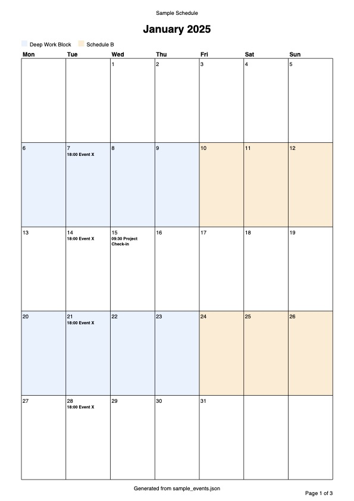

After a small change in my son's schedule, I wanted to keep everything consistent while making it easy to share. That kicked off a small calendar-planning tool with a few requirements: a clean, printable calendar view, no paid app or subscription for a one-off need, and a way to subscribe or export the calendar so it stays visible across all of my devices.

## Background

I first looked at Apple Calendar, but its printing options are limited and a presentable, readable calendar was non-negotiable. Fantastical would cover everything I needed, yet I was not keen to buy a license for a one-off need. I also considered using something like InDesign with scripting to build a polished calendar, but that felt like overkill and would have required learning additional tooling and writing a fairly complex calendar builder. Google Calendar had similar printing limitations. Given all of that, building a small software package felt like the right choice: I could script the visuals and color coding, export to ICS, and control schedule changes via versioned JSON files.

Since this was a fairly informal, one-off event, I decided to vibe-code it with Codex (see-no-evil icon).

## What is Codex

Codex is OpenAI's coding agent that works inside the terminal, taking natural language requests and then reading and editing files or running commands to complete tasks. In practice it feels like a pair programmer with tool access, so I can describe the outcome and let it stitch together code and assets quickly. By comparison, [Crush](https://github.com/charmbracelet/crush) is a terminal app from Charmbracelet that wires your tools, code, and workflows into the LLM of your choice, with multi-model support, session context, LSP-backed signals, and MCP extensibility. I've been using Crush a lot and I've been happy with how it handles small-to-medium complexity projects, mostly for macOS and iOS hobby app development. For this project, I was looking for an opportunity to give Codex a proper ride. Codex is more of a focused, guided workflow, while Crush is a configurable TUI that you can point at whichever models you prefer.

## Development

For testing and experimentation, I decided to make the development fully vibe-coded. I only occasionally opened files in Neovim to check the changes, but since the project was informal, I wanted to take the vibe-coding approach all the way.

## Prompt-led milestones

I started with a small set of prompts to define the foundations and basic principles for the tool. A few of the early prompts (cleaned up for readability) were:

> "Create a ReportLab-based script to print a calendar to PDF."
> "This project is uv-managed, so add dependencies with uv add. Split calendar rendering into its own module and use Click for the CLI."
> "Default the output path to ./out/<calendar-YYYY-MM.pdf> and create out/ if it is missing."
> "Parse JSON events with weekly recurrence and exceptions, and render them clearly in the PDF."

## Prompt-led refinements

Once the basics worked, I used follow-on prompts to push the tool toward the real-world workflow I needed:

> "Add blocks that shade calendar cells with colors and a legend defined in JSON."
> "Fix the missing Sunday in alternating weekend blocks by anchoring recurrence to the configured week start, and make Monday the default."
> "Support month ranges like 1-3 and render a single multi-page PDF, with page numbers for multi-month output."
> "Add header and footer strings, bold event labels, and allow custom fonts for readability on screens."
> "Export a consolidated ICS file alongside the PDF, with --out-ics and --no-ics switches."

## Problem

The schedule problem was not just "put events in a calendar." It was an alternating-week routine with exceptions and handoffs that needed to stay consistent, and the usual calendar apps are fine for reminders but not great at producing a clean, printable, month-at-a-glance plan with blocks of time clearly marked and a legend that other people can read without the app.

I needed a calendar that could do three things at once: show the larger weekly cadence (A/B weeks), include specific timed events, and be exportable so I could subscribe to it on my phone. Printing was the non-negotiable constraint, so I wanted a PDF that looked like something I'd actually tape on the fridge.

## Solution

I built a tiny Python CLI called `calendar-planning` that takes a JSON file as the source of truth. The JSON holds two concepts:

- `events`: timed or all-day items, optionally recurring weekly with exceptions.
- `blocks`: colored date ranges that define the week patterns (e.g., Schedule A vs Schedule B).

From that single file, the tool generates a PDF calendar (single month or a multi-month PDF) and an optional `.ics` file for calendar subscriptions. Updating the schedule is just editing JSON and re-running the command. The code is published at [github.com/konradzdeb/codex-calendar-planning](https://github.com/konradzdeb/codex-calendar-planning).

I ran it via `uv run calendar-planning ...` while the project was uv-managed. The default output is `out/calendar-YYYY-MM.pdf`, and the `.ics` file is written next to the PDF unless you pass `--no-ics` or override with `--out-ics`.

Example run (month range, with a header, and a Monday-start week):

```bash
uv run calendar-planning 2025 1-3 \
  --events data/schedule.json \
  --page-size A4 \
  --week-start MON \
  --header "2025 Schedule" \
  --footer "Generated from JSON"
```

Example input structure:

```json
{
  "events": [
    {
      "title": "Basketball practice",
      "start": "2025-01-07 18:00",
      "duration": { "hours": 1, "minutes": 30 },
      "recurrence": {
        "frequency": "weekly",
        "interval": 2,
        "byweekday": ["TUE"],
        "until": "2025-04-30",
        "except": ["2025-02-11"]
      }
    }
  ],
  "blocks": [
    {
      "title": "Schedule A",
      "color": "#E8F2FF",
      "start_date": "2025-01-06",
      "end_date": "2025-03-31",
      "recurrence": {
        "frequency": "weekly",
        "interval": 2,
        "byweekday": ["MON", "TUE", "WED", "THU"]
      }
    }
  ]
}
```

Codex stitched the CLI and PDF layout together quickly, which meant I could stay focused on the data model and the printed layout instead of wiring up a GUI. That was the whole goal: a small, disposable tool that does one job well.

## Implementation notes

The tool is deliberately small: Click handles the CLI, ReportLab handles PDF rendering, and a thin JSON parser expands recurrences into concrete dates for the months you ask for. Events are displayed inside each day cell; blocks are drawn as a soft background tint with a legend.

Event durations are optional. A timed event without a duration defaults to 15 minutes, and the same durations flow into the ICS export as explicit end times. Bi-weekly rules are just `interval: 2`.

The block logic is what makes the two-week pattern readable. It anchors each recurring block to a week start so an every-other-week pattern stays aligned even when a month begins mid-week. I hit an edge case where Sunday landed in the wrong "week bucket"; anchoring to the configured week start fixed it.

```python
def block_dates_for_month(block, year, month, week_start):
    # Anchor to the first valid week so bi-weekly rules stay consistent.
    anchor_week_start = (
        block_anchor_week_start(block.start_date, rule.byweekday, week_start)
        if rule is not None
        else week_start_date(block.start_date, week_start)
    )
    ...
    weeks_since_anchor = (current_date - anchor_week_start).days // 7
    if weeks_since_anchor % rule.interval != 0:
        continue  # Skip off-weeks for alternating schedules.
```

PDF rendering stays intentionally conservative: draw the grid, shade background blocks, then place text. When the day cell gets crowded, the layout collapses the overflow into a summary line to keep the page readable.

```python
def build_event_lines(pdf, occurrences, max_lines, max_width, font_name, font_size):
    # Render as many wrapped lines as fit, then append "+N more".
    lines = []
    shown = 0
    for occurrence in occurrences:
        wrapped = wrap_text(pdf, occurrence.label(), max_width, font_name, font_size)
        if len(lines) + len(wrapped) > max_lines:
            break
        lines.extend(wrapped)
        shown += 1
    remaining = len(occurrences) - shown
    if remaining > 0:
        lines[-1] = f"+{remaining} more"
    return lines
```

The ICS export is also simple on purpose: it expands only the months you request and writes one VEVENT per occurrence. That keeps the calendar export bounded and avoids the surprises that come with complex recurrence rules.

## Results

The tool produced exactly what I wanted: a clean A4 PDF with clearly colored week blocks and legible event labels, plus an `.ics` file I could subscribe to on my devices. It turned the schedule into a small data file I could edit in seconds, re-render, and share.

Here is a sample output generated from the `sample_events.json` fixture:



The main lesson was that for one-off planning tasks, a small CLI and a good data model are better than wrestling a heavyweight calendar app. I did not need perfect recurrence support or time zone handling; I needed a printable artifact and a repeatable process, and this delivered both with minimal overhead.
