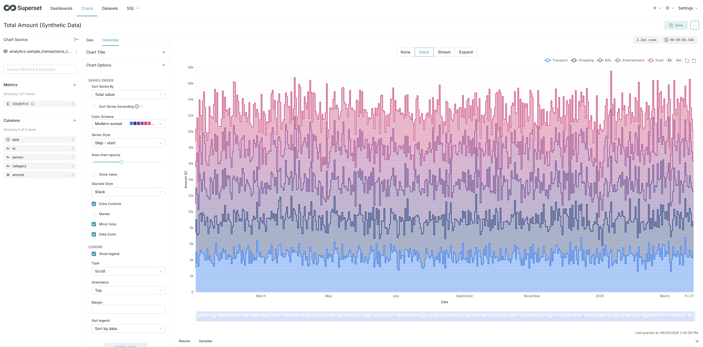

## Background

I was recently asked to help, pro bono, with analysing some life science data. From the outset I expected a steady stream of feedback along the lines of _can you show this like that_, and that prospect pulled me back to my early career days working as a researcher and analyst for various outfits. What those years taught me is that the bottleneck is rarely the analysis itself; it is the loop of sharing a result, hearing how someone would prefer to see it, and turning that around quickly. A small, self-service tool that lets people poke at the data themselves removes most of that friction.

So the goal here is deliberately narrow: run a lightweight instance of Apache Superset on a Debian laptop, let a handful of users on the local network upload their own CSV files, and give them enough to build basic dashboards without my involvement. Setting this up turned out to be surprisingly straightforward.

This is not a production setup, and it does not pretend to be. It is a pragmatic, LAN-only system that delivers most of the value with very little overhead. The approach mirrors how I tend to structure quick technical experiments: keep the dependencies simple, validate each step before moving on, and only harden the parts that genuinely need it.

---

## Architecture

The setup is intentionally minimal. Every choice below errs towards the smallest thing that works:

| Component    | Choice                     |
| :----------- | :------------------------- |
| BI tool      | Apache Superset            |
| Metadata DB  | PostgreSQL                 |
| Data storage | PostgreSQL (same instance) |
| Runtime      | Python virtual environment |
| Access       | Local network only         |

No Docker, no orchestration, no reverse proxy — just enough to get a working system that I can reason about end to end. Using a single PostgreSQL instance for both Superset's metadata and the uploaded datasets keeps the moving parts to a minimum, which matters more than tidiness on a machine that is only ever reached from the LAN.

---

## System Setup

Starting from a fresh Debian machine, the first job is to install the build toolchain and the libraries Superset's Python dependencies compile against, alongside PostgreSQL and Redis:

```bash
sudo apt update -y -V
sudo apt install -y -V \
  build-essential \
  libssl-dev \
  libffi-dev \
  python3-dev \
  python3-venv \
  python3-pip \
  libpq-dev \
  postgresql \
  redis-server
```

PostgreSQL serves double duty here, holding both Superset's own metadata and the datasets people upload. Redis is not strictly required for a setup this small, but it is cheap to have in place for caching and async queries should the workload grow.

---

## Database Configuration

With PostgreSQL running, the next step is to create a dedicated database and user for Superset:

```bash
sudo -u postgres psql
```

```sql
CREATE DATABASE superset;
CREATE USER superset_user WITH PASSWORD '***';
GRANT ALL PRIVILEGES ON DATABASE superset TO superset_user;
```

There is one easily missed step. On PostgreSQL 15 and later, `GRANT ALL` on the database no longer implies the right to create objects in the `public` schema, so the schema permissions have to be granted explicitly:

```sql
GRANT USAGE, CREATE ON SCHEMA public TO superset_user;
ALTER SCHEMA public OWNER TO superset_user;
```

Skip this and Superset fails partway through initialisation with a permission error that is far less obvious than its cause.

---

## Superset Installation

Superset installs cleanly into a Python virtual environment, which keeps it isolated from the system Python and makes it trivial to remove later. I also pull in `psycopg2-binary` so SQLAlchemy can talk to PostgreSQL:

```bash
mkdir -p ~/superset
cd ~/superset
python3 -m venv venv
source venv/bin/activate
pip install --upgrade pip setuptools wheel
pip install apache-superset psycopg2-binary
```

Superset reads its configuration from a `superset_config.py` file. At a minimum it needs to know where its metadata database lives and a secret key for signing sessions:

```python
SQLALCHEMY_DATABASE_URI = "postgresql://<user>:<password>@localhost/superset"
SECRET_KEY = "***"
```

Generate the secret key with something like `openssl rand -base64 42` rather than inventing one by hand; Superset refuses to start with the default placeholder. With the config in place, point Superset at it and run the one-time initialisation — migrating the metadata schema, creating an admin account, and loading the default roles:

```bash
export SUPERSET_CONFIG_PATH=~/superset/superset_config.py
superset db upgrade
superset fab create-admin
superset init
```

---

## Running Superset (properly)

Superset's built-in development server is fine for a first smoke test, but it prints a warning telling you not to rely on it, and rightly so — it is single-threaded and not built for sustained use. Gunicorn with gevent workers is the recommended way to run it:

```bash
pip install gunicorn gevent
```

Bind it to all interfaces so the rest of the LAN can reach it, with a handful of workers to handle concurrent users:

```bash
gunicorn \
  --workers 4 \
  --worker-class gevent \
  --bind 0.0.0.0:8088 \
  "superset.app:create_app()"
```

At this point Superset is reachable from any machine on the network at:

```text
http://<machine-ip>:8088
```

Running it by hand is fine for testing, but it dies the moment the terminal closes or the laptop reboots. The next step makes it survive both.

---

## Systemd Service

Wrapping the Gunicorn command in a systemd unit makes Superset start on boot, restart if it crashes, and wait for PostgreSQL and Redis to be ready first. Adjust the `User` and paths to match your own account:

```bash
sudo nvim /etc/systemd/system/superset.service
```

```ini
[Unit]
Description=Apache Superset
After=network.target postgresql.service redis-server.service

[Service]
User=jan
WorkingDirectory=/home/jan/superset
Environment="SUPERSET_CONFIG_PATH=/home/jan/superset/superset_config.py"
ExecStart=/home/jan/superset/venv/bin/gunicorn --workers 4 --worker-class gevent --bind 0.0.0.0:8088 "superset.app:create_app()"
Restart=always

[Install]
WantedBy=multi-user.target
```

Reload systemd so it picks up the new unit, then enable and start it:

```bash
sudo systemctl daemon-reload
sudo systemctl enable superset
sudo systemctl start superset
```

`systemctl status superset` and `journalctl -u superset -f` are then the two commands worth remembering whenever something misbehaves.

---

## Network Access

Binding to `0.0.0.0:8088` means Superset listens on every interface, which is convenient but worth fencing in. Even on a home network I would rather the service be unreachable from anything outside the local subnet, so I let `ufw` enforce that explicitly:

```bash
sudo apt install -y ufw
sudo ufw default deny incoming
sudo ufw allow from 192.168.50.0/24 to any port 8088 proto tcp
sudo ufw enable
```

Substitute your own subnet for `192.168.50.0/24`. With this in place the dashboard is available to everyone on the LAN and to nobody beyond it, which is exactly the boundary I want for a tool holding someone else's data.

---

## Adding Data

Superset will not expose a database until you tell it to, and CSV uploads are off by default for good reason — they let any authorised user write tables into your warehouse. Both are enabled through the same connection settings:

1. Add the PostgreSQL instance as a database connection.
2. Under that connection's advanced settings, tick **Allow file uploads to database** and set the target schema (I use a dedicated `analytics` schema rather than `public`, so uploaded data stays separate from Superset's own tables).

Users then load their own files from **Settings → Upload file to database**, picking the CSV, the destination schema, and a table name. This is the part that makes the setup genuinely self-service: once it works, people stop asking me to ingest data for them.

---

## Data Modelling

CSV uploads are convenient but blunt: every column tends to arrive as text, and Superset works best when it can lean on real types and a unique key. A couple of small fixes, defined once as virtual datasets in SQL Lab, cover most of what an uploaded file needs.

The first is casting columns to their proper types so that, for instance, a date behaves like a date in time-series charts and filters:

```sql
SELECT date::date AS date, *
FROM analytics.sample_transactions;
```

The second is giving each row a stable identifier. Superset's table views and certain chart types are much happier when a dataset has a unique key, and an uploaded CSV rarely comes with one:

```sql
SELECT
  row_number() OVER () AS id,
  *
FROM analytics.sample_transactions;
```

Note the empty `OVER ()` — `row_number()` is a window function, and PostgreSQL will reject it without an `OVER` clause even when you want no partitioning or ordering at all.

---

## Visualisation Notes

The one conceptual hurdle worth flagging is aggregation grain. Superset charts can behave in surprising ways if the data is aggregated too early, because some visualisations need the underlying distribution rather than a summary statistic.

Box plots are the clearest example: they need the raw values to compute quartiles and whiskers, so feeding them an `AVG(amount)` collapses the very spread they are meant to show. The fix is to be deliberate about grain — keep the dataset at row level where the chart needs the distribution, and aggregate to a controlled grain such as per day only where a summary is genuinely what you want. The surrogate key from the previous section helps here, since it gives Superset a row-level handle to work with.

---

## Users and Permissions

Users are created through the UI under **Settings → List Users**. For the people sharing this instance I assign two built-in roles rather than the catch-all Admin:

- **Alpha** — full access to datasets, charts, and dashboards, but without the ability to manage other users or change global settings.
- **sql_lab** — access to SQL Lab so they can write the kind of casting and keying queries described above.

Together these let collaborators create datasets, explore with SQL, and build dashboards — everything the workflow needs. Admin stays reserved for me: it can edit security, database connections, and other users, which is more rope than a casual user should be handed on a shared machine.

---

## Backups

Because everything — metadata, dashboards, and uploaded data — lives in one PostgreSQL database, a single nightly `pg_dump` is enough to capture the whole system. A line in cron handles it:

```bash
sudo crontab -e
```

```cron
0 2 * * * sudo -u postgres pg_dump superset > /home/jan/backups/superset_$(date +\%F).sql
```

The `%F` is escaped because cron treats a bare `%` as a newline. It is worth confirming the `backups` directory exists and, every so often, that the dumps actually restore — an untested backup is only a hopeful one.

---

## Observations

A few things stood out by the time the setup had settled into daily use:

- Superset is powerful but firmly UI-driven, and SQL Lab is the escape hatch that makes it workable — most of the real shaping of data happened there.
- PostgreSQL permissions were by far the most common failure point, and the schema-level grants in particular caused the only genuinely confusing error of the whole exercise.
- Charts reward an understanding of aggregation behaviour; getting the grain right up front saved more time than any other single decision.
- Systemd and Gunicorn together turned a fragile, terminal-bound process into something stable enough that I stopped thinking about it.

---

## What I Did Not Do

It is worth being explicit about what I left out, since the omissions are choices rather than oversights:

- **Docker** — a single laptop with one tenant does not need containerisation, and a virtual environment is easier to inspect and tear down.
- **A reverse proxy (nginx)** — there is nothing in front of Gunicorn to terminate or route, because nothing needs to be.
- **HTTPS** — on a trusted LAN with no external exposure, certificate management would be effort spent on a threat that is not present here.
- **External exposure** — the firewall rule above is precisely so the service never leaves the local network.

Each of these would matter for a production deployment. For a home setup they add complexity and maintenance for little real benefit, and the discipline is in knowing which corners are safe to cut.

---

## Summary

What I took away from the process is how little it takes to stand up something genuinely useful. On a single Debian laptop the result gives a small group multi-user access, self-service CSV ingestion, SQL exploration, and dashboard building — the whole feedback loop that used to slow this kind of work down, now handled by the people closest to the data.

It is not production-grade, and it does not try to be. As a lightweight environment for experimentation, personal analytics, or small shared use, though, it does everything I needed and nothing I did not. As with most tooling setups, the goal was never completeness but sufficiency — and on that measure it has more than earned its place.
