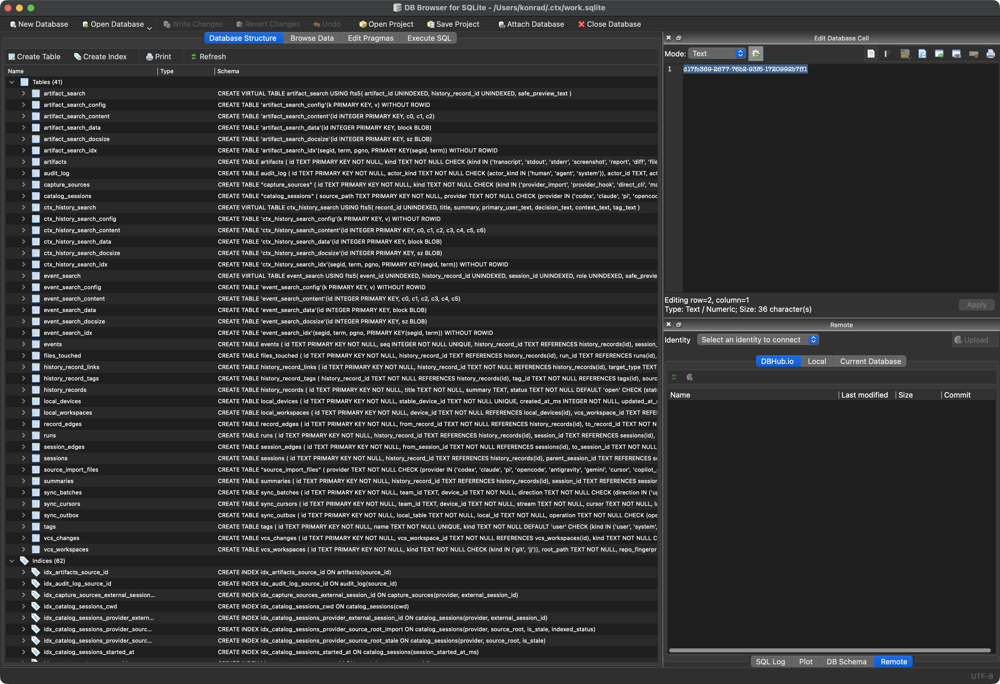

When working with LLMs, the prompt is only part of the problem. The harder part is deciding which context should travel with the request: source files, command output, constraints, previous decisions, and the exact shape of the failure.

Most writing about LLMs asks how they make our work more efficient. The more interesting question here is narrower: how do we work more efficiently with the models themselves?

In my work, that often means leveraging multiple tools, each with a focused role, rather than treating the LLM as a single chat window that has to hold everything at once.

[`ctx`](https://github.com/context-hub/generator) fits into that gap. I want it to act as a small context layer between a project and an LLM, so I can stop rebuilding the same explanation by hand and send targeted, repeatable bundles instead.

## What is ctx?

Here, [`ctx`](https://github.com/context-hub/generator) is a local CLI for working with agent history. It can discover and index previous sessions, list sources, search indexed history, show transcripts or individual events, locate metadata, expose read-only tools over MCP, and run read-only SQL against its local index.

That makes it useful as a memory and inspection layer for LLM work. Instead of relying on whatever a given chat client remembers, I can query what actually happened: which sessions ran, what context was captured, where it came from, and which pieces are worth reusing.

## Why this matters

In day-to-day development, most LLM mistakes I see come from missing or stale context:

- an old assumption about how the project is structured
- a missing config file that changes the build path
- generated files mixed in with source files
- logs copied without the command that produced them
- a request that describes intent but omits the current state of the repo

This is especially visible in larger repositories, where "look at the code" is too broad and "here is one file" is too narrow. The fix is not more context but the right context: explicit rather than implied, small enough to inspect, grounded in current files and command output, and stripped of unrelated project noise, in a form that is easy to review before it reaches the model.

Interfaces such as [Magentic-UI](https://arxiv.org/abs/2507.22358) show how multi-agent tools can make human-agent collaboration easier to manage, but even the best interface does not remove the need for context you can inspect. What I want is the ability to query my own history of prompts, sessions, sources, and captured context, and to assemble it deliberately.

## What I want from ctx

For LLM work, a useful `ctx` workflow should make it easy to collect:

- the files that define the behavior being changed
- nearby tests or examples
- project instructions and conventions
- current git state
- relevant command output
- a short human-written task note

It should also make omissions obvious. If I am asking why a payment webhook retries forever, I want the bundle to include the handler, queue configuration, idempotency checks, recent logs, and the failing test or trace. If I am asking for a Swift refactor, I want the relevant views, models, tests, and build output.

The search mechanisms exposed by most CLI or chat clients are useful for lookup, but they are not ideal for more demanding questions. Complex expressions, date ranges, source types, status flags, and combined filters are usually better handled by querying the underlying data directly.

## Complex CLI searches

The `ctx search` command supports text queries, repeated terms, provider filters, workspace filters, time windows, event types, touched-file metadata, subagent inclusion, session drill-down, and JSON output. For example, while working on a hobby app, I wanted to find sessions that touched `Defaults.swift` and mentioned SwiftUI's `@AppStorage` property wrapper. Full-text search tokenises the `@` away, so the search term is just the bare word:

```bash
ctx search "AppStorage" --file "Defaults.swift"
```

This is useful, but it is still a search interface with flags. SQL is the better tool when I want arbitrary predicates: sessions from today, only a specific provider, one workspace prefix, a selected source type, non-stale catalog rows, and a custom sort order in the same question.

## Direct SQL access

One practical advantage of [`ctx`](https://github.com/context-hub/generator) is that it exposes the underlying SQLite database directly. The location is visible from `ctx status`, so there is no hidden store to hunt for. I abbreviate my home directory to `~` below; the command itself prints absolute paths.

```bash
ctx status
```

```text
data_root: ~/.ctx
database_path: ~/.ctx/work.sqlite
config_path: ~/.ctx/config.toml
initialized: true
indexed_items: 7327
indexed_sources: 338
cataloged_sessions: 252
indexed_catalog_sessions: 250
pending_catalog_sessions: 2
failed_catalog_sessions: 0
stale_catalog_sessions: 1
local_only: true
```

Because the store is ordinary SQLite, it also lends itself to careful inspection with common SQLite tools. I do not have to treat the [`ctx`](https://github.com/context-hub/generator) CLI as the only view into the data: DB Browser for SQLite can open the same `work.sqlite` file and show tables, indexes, FTS virtual tables, and raw rows directly.



The simplest way in is to get your bearings. A plain `ctx sql` query lists the tables and views, so I can see the shape of the store before writing anything more involved:

```bash
ctx sql "
SELECT name, type
FROM sqlite_master
WHERE type IN ('table', 'view')
ORDER BY type, name;
"
```

```text
name                       | type
-------------------------- | -----
artifact_search            | table
artifact_search_config     | table
artifact_search_content    | table
artifact_search_data       | table
artifact_search_docsize    | table
artifact_search_idx        | table
artifacts                  | table
audit_log                  | table
capture_sources            | table
catalog_sessions           | table
ctx_history_search         | table
...
```

For one-off read-only commands like that, `ctx sql` is the safe default. Once I want to explore — join tables, tune a query, and reshape the result — [`litecli`](https://github.com/dbcli/litecli) is more comfortable, and it opens the same file directly:

```bash
litecli "$HOME/.ctx/work.sqlite"
```

This is not limited to schema browsing. Once inside [`litecli`](https://github.com/dbcli/litecli), the search tables are available too, so I can run full-text queries and join them back to event metadata. For example, to rank matching events for a phrase:

```sql
SELECT
  bm25(event_search) AS rank,
  e.event_type,
  substr(es.safe_preview_text, 1, 90) AS preview
FROM event_search AS es
JOIN events AS e ON e.id = es.event_id
WHERE event_search MATCH 'webhook retry'
ORDER BY rank
LIMIT 10;
```

For a statement-scoped view that is not stored in the database, I can use a CTE rather than `CREATE VIEW`. This example selects yesterday's user queries, treats the provider in `payload_json` as the tool name, and groups the results by tool:

```sql
WITH yesterday_queries AS (
  SELECT
    COALESCE(json_extract(e.payload_json, '$.provider'), 'unknown') AS tool,
    json_extract(e.payload_json, '$.body.text') AS query_text
  FROM events AS e
  WHERE e.event_type = 'message'
    AND e.role = 'user'
    AND date(e.occurred_at_ms / 1000, 'unixepoch', 'localtime')
      = date('now', 'localtime', '-1 day')
    AND json_extract(e.payload_json, '$.body.text') IS NOT NULL
)
SELECT
  tool,
  COUNT(*) AS query_count,
  group_concat(
    substr(replace(query_text, char(10), ' '), 1, 120),
    char(10) || '---' || char(10)
  ) AS query_samples
FROM yesterday_queries
GROUP BY tool
ORDER BY query_count DESC, tool;
```

That is where [`litecli`](https://github.com/dbcli/litecli) becomes more than a database browser. It gives me an interactive scratchpad for the same search index: autocomplete tables, tune the `MATCH` expression, add joins, add date filters, and reshape the result until it is the right evidence for the next prompt.

## Sharing context

[`ctx`](https://github.com/context-hub/generator) also helps when I move work between LLMs. Because the index records sessions, touched files, and event previews, I can ask another client to retrieve the narrow slice I need instead of pasting a long transcript. Staying with the same example, I could ask Claude to search the history — even though those sessions were originally run under a different tool:

> Use `ctx` to find sessions that discussed application defaults, especially sessions that touched `Defaults.swift` or mentioned SwiftUI's `@AppStorage` property wrapper.

The model can then use [`ctx`](https://github.com/context-hub/generator) to run targeted searches and return a compact summary:

> **Sessions that focused on application defaults**
>
> 1. `<session-id>` (`codex`) — strongest match
>
>    This session discussed the defaults layer, the reset path, and changes related to `@AppStorage`.
>
> ...

The local CLI also exposes read-only tools over MCP through `ctx mcp serve`. That is the integration point I want when another assistant should search or inspect history without receiving write access.

## Conclusion

The value of [`ctx`](https://github.com/context-hub/generator) is not that it replaces judgment about what context belongs in a prompt. Its value is that it makes that judgment easier to apply: search first, inspect the underlying SQLite data when the flags are not enough, and pass the next model a small, grounded set of evidence instead of a vague summary or a pasted transcript.
